# 2주차

# DOCKER의 개념


## DOCKER

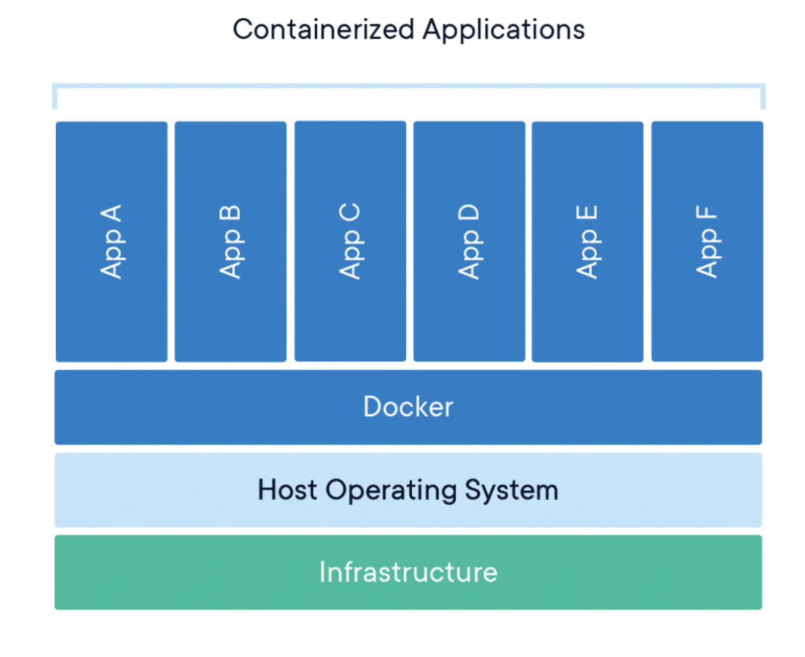

`Docker`를 한줄로 요약하자면 **리눅스 컨테이너를 기반으로하는 오픈소스 가상화 플랫폼** 이다.  


## CONTAINER

> 컨테이너는 시스템의 나머지 부분과 격리된 프로세스 세트입니다.  
> 이러한 프로세스를 실행하는 데 필요한 모든 파일은 고유한 이미지에서 제공되므로, Linux 컨테이너는 개발 단계에서 테스트, 프로덕션에 이르기까지 이식성과 일관성을 유지할 수 있습니다.

컨테이너는 동일한 운영 체제 커널을 공유하고 시스템의 나머지 부분으로부터 애플리케이션 프로세스를 격리한다.  

가상화와는 비슷하면서도 다르다. 아래의 그림을 보자.

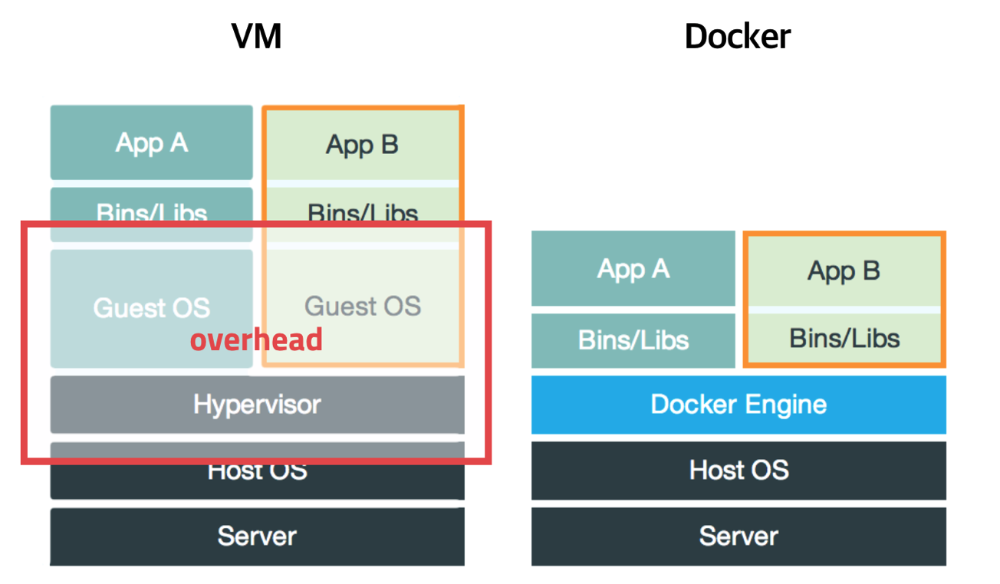

가상화는 `HYPERVISOR`를 이용하여 하드웨어를 에뮬레이션 한 뒤, 그 위에 각각의 GUEST OS를 올려서 애플리케이션을 실행하는 방법을 취하고 있다.

반면에 `컨테이너`는 `Docker Engine` 위에서 애플리케이션의 실행에 필요한 바이너리 파일들만 올라가게 된다.  

`컨테이너`는 가상화와는 달리 원래의 HOST OS위에서 동작하므로, HOST의 커널들을 공유한다. 커널을 공유하게 되면, IO처리가 쉽게되기 때문에 성능이 더 잘 나올 수 있다.  

즉 `컨테이너`는 HOST OS가 사용하는 자원을 분리하여 여러 환경을 만들 수 있도록 하는것 이다.


## IMAGE

도커의 이미지는 컨테이너 실행에 필요한 파일과 설정값을 포함하고 있는 것으로, Immutable하게 존재한다.  
컨테이너는 이미지를 실행한 상태라고 정의할 수 있다.  

이미지는 컨테이너를 실행하기 위한 모든 정보를 가지고 있기 때문에 더 이상 의존성 파일을 컴파일하고 이것저것 설치할 필요가 없다.  

새로운 서버가 추가되면 미리 만들어 놓은 이미지를 다운받고 컨테이너를 생성만 하면 된다.

개인적으로 도커의 가장 큰 장점이라고 생각한다.  

같은 프로그램을 실행하더라도 필요한 의존성 파일의 버전이 하나만 달라도 오류가 나기 태반인데, 이 문제를 이미지를 이용해서 간단하게 해결하였다.  

<br>
<br>


# 2주차 내용 분해하기


## 대략적 흐름

1. repository에 push
2. git action이 [deploy.yml](#deployyml) 설정대로 서버에서 동작
3. [deploy.sh](#deploysh) 실행
4. [docker-compose.prod.yml](#docker-composeprodyml) 설정대로 컨테이너 생성

<br>

## deploy.yml

git action에 `.github/workflows/deploy.yml` 이 저장된다.  

`deploy.yml`에 따르면 

```yaml
run: |
        touch .env
        echo "${{ secrets.ENV_VARS }}" >> .env
```

.env 라는 파일을 만들고, .env 파일에 ${{ secrets.ENV_VARS }} 을 추가한다.  

`ENV_VARS` 에 env.prod 내용들을 적어주었다. 

이 부분에서 DB를 붙인다. 처음에 로컬부분과 서버부분이 다른데, 인스턴스에 DB가 없어서 의아했었다.  

보안과 편의상의 이유로 인스턴스에 DB는 올리지 않고 rds를 사용한다.

```yaml
 name: create remote directory
      uses: appleboy/ssh-action@master
      with:
        host: ${{ secrets.HOST }}
        username: ubuntu
        key: ${{ secrets.KEY }}
        script: mkdir -p /home/ubuntu/srv/ubuntu
```

그 뒤, ssh를 이용하여 /home/ubuntu/srv/ubuntu 라는 디렉토리를 만든다.  
ec2 서버에 ssh를 이용하여 접속할 수 있도록, secrets.KEY에 ssh key를 넣어놓았다.  

```yaml
name: copy source via ssh key
      uses: burnett01/rsync-deployments@4.1
      with:
        switches: -avzr --delete
        remote_path: /home/ubuntu/srv/ubuntu/
        remote_host: ${{ secrets.HOST }}
        remote_user: ubuntu
        remote_key: ${{ secrets.KEY }}
```

이 부분이 가장 이해가 안갔다. 먼저 [burnett01/rysnc-deployments](https://github.com/Burnett01/rsync-deployments) 를 찾아보았다.  

`Github Action`이 [GITHUB_WORKSPACE](#github-workspace)에 있는 파일들을 `rsync`를 통해 배포할 수 있도록 해준다고 한다.

`rsync`란 간단하게 말하자면 원격에 있는 파일과 디렉토리를 복사하고 동기화 하기 위해서 사용하는 툴이다.  
remote-update protocol을 이용하여 차이가 있는 파일만 복사하고, 데이터를 압축하여 송/수신하기 때문에 더 적은 bandwidth를 사용한다는 장점이 있다.

따라서, `rsync`를 사용하여 ec2서버의 /home/ubuntu/srv/ubuntu/ 디렉토리에 있는 소스와 GITHUB_WORKSPACE에 있는 소스 중 차이가 있는 파일들만 ec2 서버의 /home/ubuntu/srv/ubuntu/에 올려준다는 것이다.

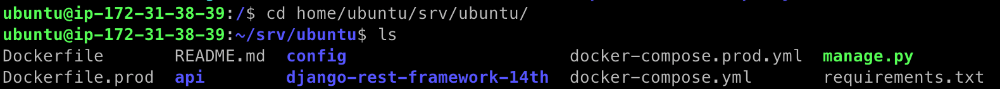
실제로 ec2 서버에 접속하여 해당경로로 들어가보면 github 소스코드가 그대로 올라가있는걸 볼 수 있다.

<br>

switches에 보면 -avzr --delete라는 옵션이 달려있다. 각각 옵션들의 뜻은 다음과 같다.  

a : archive 모드로 타임스탬프, 심볼릭링크, 퍼미션, 그룹, 소유자, 장치 등의 파일 보존  
v : 상세 정보 출력  
r : 하위 디렉토리까지 복사  
z : 데이터를 압축해서 전송. 단 destination에서는 압축이 해제되어 들어감  
--delete : 원본 소스에 없는 파일은 백업 서버에서 삭제

만약 --delete 옵션이 없다면, 파일을 삭제하고 push 하였을 때, repository와 서버의 싱크가 맞지않을 것이다.

```yaml
- name: executing remote ssh commands using password
      uses: appleboy/ssh-action@master
      with:
        host: ${{ secrets.HOST }}
        username: ubuntu
        key: ${{ secrets.KEY }}
        script: |
          sh /home/ubuntu/srv/ubuntu/config/scripts/deploy.sh
```

마지막으로 ssh를 이용하여 ec2 서버 내에서 `deploy.sh`를 실행한다.

여기까지의 과정이 repository에 push를 할 때 생기는 일이다. 이러한 일련의 과정들을 거치므로 push할 때마다 서버에 push한 코드가 반영된다는 것을 알 수있다.

## deploy.sh

`deploy.yml`에서 서버내의 `deploy.sh`를 실행하고 끝났다.

```shell
if ! type docker > /dev/null
then
  echo "docker does not exist"
  echo "Start installing docker"
  sudo apt-get update
  sudo apt install -y apt-transport-https ca-certificates curl software-properties-common
  curl -fsSL https://download.docker.com/linux/ubuntu/gpg | sudo apt-key add -
  sudo add-apt-repository "deb [arch=amd64] https://download.docker.com/linux/ubuntu bionic stable"
  sudo apt update
  apt-cache policy docker-ce
  sudo apt install -y docker-ce
fi
```

docker가 없다면, docker를 설치해준다.

```shell
if ! type docker-compose > /dev/null
then
  echo "docker-compose does not exist"
  echo "Start installing docker-compose"
  sudo curl -L "https://github.com/docker/compose/releases/download/1.27.3/docker-compose-$(uname -s)-$(uname -m)" -o /usr/local/bin/docker-compose
  sudo chmod +x /usr/local/bin/docker-compose
fi
```

docker-compose가 없다면 docker-compose를 설치해준다.

```shell
echo "start docker-compose up: ubuntu"
sudo docker-compose -f /home/ubuntu/srv/ubuntu/docker-compose.prod.yml up --build -d
```

`docker-compose.prod.yml`에 저장되어있는 모든 서비스를 실행한다.  
--build 옵션이 달려있기 때문에, 서비스 실행 전에 이미지들을 새로 만든다.

<br>

## docker-compose.prod.yml

`docker-compose`는 docker 컨테이너들의 설정과 관계들을 담은 파일이다.   
`docker-compose.prod.yml`엔 web이란 컨테이너와 nginx 컨테이너가 존재한다.

```yaml
web:
    container_name: web
    build:
      context: ./
      dockerfile: Dockerfile.prod
    command: gunicorn django-rest-framework-14th.wsgi:application --bind 0.0.0.0:8000
    environment:
      DJANGO_SETTINGS_MODULE: django-rest-framework-14th.settings.prod
    env_file:
      - .env
    volumes:
      - static:/home/app/web/static
      - media:/home/app/web/media
    expose:
      - 8000
    entrypoint:
      - sh
      - config/docker/entrypoint.prod.sh
```

web 이라는 컨테이너의 설정이다.  
컨테이너 생성에 필요한 이미지로 [Dockerfile.prod](#dockerfileprod)를 사용하였다.  

entrypoint를 보면 sh config/docker/entrypoint.prod.sh 명령어를 이용해 `entrypoint.prod.sh` 를 실행하라고 나와있다.

`entrypoint.prod.sh` 스크립트는 다음과 같다.

```shell
# entrypoint.prod.sh
#!/bin/sh

python manage.py collectstatic --no-input

exec "$@"
```

[`collectstatic`](#static-파일-처리)을 실행하라는 쉘스크립트이다.

```shell
> gunicorn django-rest-framework-14th.wsgi:application --bind 0.0.0.0:8000
```

`command`에 적힌 명렁어가 실행된다. wsgi인 `gunicorn`이 실행된다.

실제로 이 컨테이너에서 실행되는 command를 서버에 접속하여 찾아보면 다음과 같다.

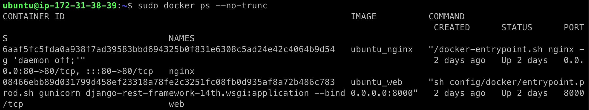

```shell
> sh config/docker/entrypoint.prod.sh gunicorn django-rest-framework-14th.wsgi:application --bind 0.0.0.0:8000
```

<br>
<br>

다음으로 nginx 컨테이너의 설정이다.

```yaml
  nginx:
    container_name: nginx
    build: ./config/nginx
    volumes:
      - static:/home/app/web/static
      - media:/home/app/web/media
    ports:
      - "80:80"
    depends_on:
      - web
        
  volumes:
    static:
    media:
```

컨테이너 생성에 필요한 이미지로 config/nginx/Dockerfile 을 사용할 것이다.

nginx 컨테이너는 static과 media라는 volume 컨테이너를 생성했다.  

static volume의 경우 nginx 컨테이너 내의 /home/app/web/static 이라는 디렉토리가 서버 내부의 ~/var/lib/docker/volumes/static/_data 디렉토리에 마운트 된다.  

media volume의 경우도 마찬가지로 nginx 컨테이너 내의 /home/app/web/static 이라는 디렉토리가 서버 내부의 ~/var/lib/docker/volumes/media/_data 디렉토리에 마운트 된다.

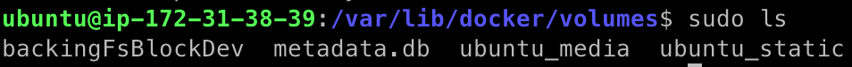

실제로 디렉토리가 있는지 ec2 서버에 접속하여 찾아보았다. volume 컨테이너들이 실제 서버의 ubuntu_media, ubuntu_static 으로 존재한다.

여기까지 서버가 올라가는 과정들을 샅샅히 파헤쳐 보았다!

<br>
<br>

# etc

## Dockerfile

```dockerfile
# 가져올 이미지 
FROM python:3.8.3-alpine
ENV PYTHONUNBUFFERED 1

# 디렉토리 생성 및 설정
RUN mkdir /app
WORKDIR /app

# 필요한 프로그램 설치 (MariaDB, mysql)
RUN apk add --no-cache mariadb-connector-c-dev
RUN apk update && apk add python3 python3-dev mariadb-dev build-base && pip3 install mysqlclient && apk del python3-dev mariadb-dev build-base

# 프로젝트에 필요한 라이브러리 설치
COPY requirements.txt /app/requirements.txt
RUN pip install -r requirements.txt

# 모든 파일 복사
COPY . /app/
```

`Dockerfile`의 경우 컨테이너 내부의 리눅스 shell에서 실행될 명령어들을 담은 것이다.  

먼저 python:3.8.3-alpine 이란 이미지를 가져온다.

app이란 디렉토리를 만들고, WORKDIR을 /app으로 지정하였다.

apk add --no-cache mariadb-connector-c-dev,  
apk update &&   
apk add python3 python3-dev mariadb-dev build-base &&   
pip3 install mysqlclient && apk del python3-dev mariadb-dev build-base 라는 명령어를 실행하여, 필요한 패키지들을 설치하고, 설치 한 뒤 필요없는 패키지들을 삭제하였다.

이후, COPY requirements.txt /app/requirements.txt  
RUN pip install -r requirements.txt 를 이용하여 requirements.txt를 복사한 뒤, 프로젝트에 필요한 파이썬 라이브러리들을 설치하였다.

COPY . /app/ 을 이용하여 Dockerfile이 있는 경로의 모든 파일들을 전부 도커 컨테이너 내의 /app/ 에 복사하였다.  

이렇게 `Dockerfile`은 실제 실행되는 명령어들을 담당한다. 리눅스에 익숙하다면 직관적으로 볼 수 있을 것이다.

## Dockerfile.prod
```dockerfile
# BUILDER #
###########

# pull official base image
FROM python:3.8.3-alpine as builder

# set work directory
WORKDIR /usr/src/app


# set environment variables
ENV PYTHONDONTWRITEBYTECODE 1
ENV PYTHONUNBUFFERED 1

# install psycopg2 dependencies
RUN apk update && apk add python3 python3-dev mariadb-dev build-base && pip3 install mysqlclient && apk del python3-dev mariadb-dev build-base

# install dependencies
COPY ./requirements.txt .
RUN pip wheel --no-cache-dir --no-deps --wheel-dir /usr/src/app/wheels -r requirements.txt


#########
# FINAL #
#########

# pull official base image
FROM python:3.8.3-alpine

# create directory for the app user
RUN mkdir -p /home/app

# create the app user
RUN addgroup -S app && adduser -S app -G app

# create the appropriate directories
ENV HOME=/home/app
ENV APP_HOME=/home/app/web
RUN mkdir $APP_HOME
RUN mkdir $APP_HOME/static
RUN mkdir $APP_HOME/media
WORKDIR $APP_HOME

# install dependencies
RUN apk update && apk add libpq
RUN apk update \
    && apk add --virtual build-deps gcc python3-dev musl-dev \
    && apk add --no-cache mariadb-dev
COPY --from=builder /usr/src/app/wheels /wheels
COPY --from=builder /usr/src/app/requirements.txt .
RUN pip install mysqlclient
RUN pip install --no-cache /wheels/*

# copy entrypoint-prod.sh
COPY ./config/docker/entrypoint.prod.sh $APP_HOME

# copy project
COPY . $APP_HOME

# chown all the files to the app user
RUN chown -R app:app $APP_HOME

# change to the app user
USER app
```

`Dockerfile.prod`는 스테이지가 2개인 multi-stage dockerfile이다.  
multi-stage를 사용하는 이유는 스테이지를 나누어 빌드파일과 실행파일을 분리할 수 있기 때문에, docker 이미지를 더욱 가볍게 할 수 있기 때문이다.

위에 builder 부분은 Dockerfile과 비슷한 부분이 많다.   
먼저 python:3.8.3-alpine 이미지를 가져온 뒤 디렉토리들을 생성해주는데 /home/app과 /home/app/web을 환경변수로 각각 설정하였다.  

$APP_HOME/static, $APP_HOME/media 는 nginx 컨테이너에서 volume container를 마운트 할 실제 디렉토리들이다.  

의존적인 모듈들을 설치한다.
이 때
```dockerfile
COPY --from=builder /usr/src/app/wheels /wheels
COPY --from=builder /usr/src/app/requirements.txt .
```
이런식으로 builder 스테이지에 빌드를 하여 만들어진 whl파일들이 final 스테이지의 /wheels에 모두 복사될 것 이다.

```dockerfile
RUN pip install mysqlclient
RUN pip install --no-cache /wheels/*
```

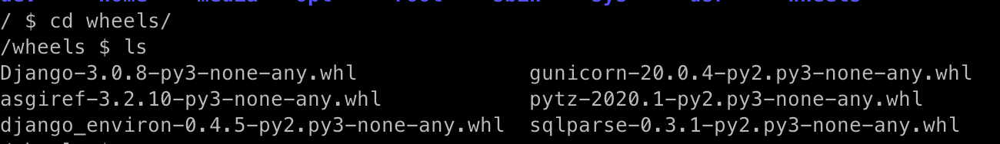
`mysqlclient`와 /wheels/에 존재하는 모든 패키지들을 설치한다.  
여기서 의문점이 생겼다.  
~~1. 왜 mysqlclient를 설치하는데 필요했던 의존적 패키지들을 지우지 않을까?~~  
2. 왜 컨테이너 내의 /wheels 폴더를 삭제하지 않을까? 

코드를 내가 만든것이 아니므로 아직 답을 찾진 못했다.

그 뒤 `entrypoint.prod.sh` (collectstatic 실행 shell) 를 $APP_HOME 에 복사한다.

유저 설정을 하고 이미지 설정이 끝난다!

## docker-compose.yml

```yaml
version: '3'
services:

  db:
    container_name: db
    image: mysql:5.7
    restart: always
    environment:
      MYSQL_ROOT_HOST: '%'
      MYSQL_ROOT_PASSWORD: mysql
    expose:
      - 3306
    ports:
      - "3307:3306"
    env_file:
      - .env
    volumes:
      - dbdata:/var/lib/mysql

  web:
    container_name: web
    build: .
    command: sh -c "python manage.py migrate && python manage.py runserver 0.0.0.0:8000"
    environment:
      MYSQL_ROOT_PASSWORD: mysql
      DATABASE_NAME: mysql
      DATABASE_USER: 'root'
      DATABASE_PASSWORD: mysql
      DATABASE_PORT: 3306
      DATABASE_HOST: db
      DJANGO_SETTINGS_MODULE: django-rest-framework-14th.settings.dev
    restart: always
    ports:
      - "8000:8000"
    volumes:
      - .:/app
    depends_on:
      - db
volumes:
  app:
  dbdata:
```

`docker-compose.yml`은 yaml파일 형식으로 도커 컨테이너들의 관계와 설정들을 담은 파일이다.

web과 db라는 `컨테이너` 들이 `docker-compose.yml`에 설정된 것을 볼 수 있다. 

web 컨테이너는 실행되면 migration하고, 서버를 실행시킨다. db에 연결하기 위해 유저 이름과 비밀번호, 포트등이 설정되어 있는 것을 볼 수 있다.

db 컨테이너는 이미지로 존재한다. 이 파일은 로컬에서의 실행만을 관장하기 때문에, db 컨테이너를 설정하였다.

## static 파일 처리

> Django 개발 서버를 시작했습니다. 개발 서버는 순수 Python으로 작성된 경량 웹 서버입니다. Django에 포함되어 있어 아무 설정 없이 바로 개발에 사용할 수 있습니다.  
 
> 이쯤에서 하나 기억할 것이 있습니다. 절대로 개발 서버를 운영 환경에서 사용하지 마십시요. 개발 서버는 오직 개발 목적으로만 사용하여야 합니다(우리는 웹 프레임워크를 만들지 웹 서버를 만들지는 않거든요).

실제 운영 환경에선 `nginx`, `apache`와 같은 static 파일만을 처리하는 웹 서버를 사용해야 한다.  
CEOS에선 웹 서버로 `nginx`, wsgi로 `gunicorn`을 사용한다. 

개발 환경에서 `django`만 사용한다면 runserver 실행 시 static 파일들을 /static/ 디렉토리로 모아준다.  
이것은 `django.contrib.staticfiles` 라는 모듈이 static 파일의 전송을 담당해서 그렇다.   
하지만, `DEBUG` 설정을 False로 설정하는 운영 환경에선 동작하지 않는다. (settings/dev.py, prod.py 참조)  

nginx도 사용해야하는 운영 환경에선 static 파일들을 수동으로 모아주고 어디에 있는지 설정도 해주어야 한다.  
이 때 수동으로 static 파일들을 모아주는 명령어가 `collectstatic` 이다. 

```shell
> python manage.py collectstatic
```

`collectstatic`을 실행하였을 때 어디로 모이게 될까?

```python
# settings/base.py
...
STATIC_URL = '/static/'
STATIC_ROOT = os.path.join(BASE_DIR, 'static')
```

설정파일에 있는 `STATIC_ROOT`가 `collectstatic`이 실행되었을 때 static 파일들이 모이는 곳이다.

이제 `python manage.py collectstatic` 명령어를 실행하면 static 이란 폴더에 static 파일들이 전부 모인다!

웹서버인 nginx에도 `STATIC_ROOT`에 static 파일들이 있다는 것을 알려야 한다.

```
# config/nginx/nginx.conf

location /static/ {
alias /home/app/web/static/;
}
```

`nginx.conf`에 위와 같은 설정이 있으므로 `/static/` URL로 오는 static request들을 `web/static/`에서 찾은 뒤 response한다.


## COMMAND & ENTRYPOINT

> The `ENTRYPOINT` specifies a command that will always be executed when the container starts. The `CMD` specifies arguments that will be fed to the `ENTRYPOINT`.
> 
즉 `ENTRYPOINT`의 경우엔 항상 실행이 되는 명령어이고, `CMD`의 경우엔 default한 인자라고 생각할 수 있다.

이를 직접 보기 위해서 Dockerfile을 다음과 같이 작성하였다.

```Dockerfile
# Dockerfile
FROM python:3.8.3-alpine
ENV PYTHONUNBUFFERED 1

WORKDIR /app

ADD test1.py /app
ADD test2.py /app

ENTRYPOINT ["python"]
CMD ["test1.py", "CMD gave args"]
```

컨테이너가 run되면, 인자로 주어진 파일을 실행하는 컨테이너를 만들었다.  
`CMD`을 test1.py CMD gave args 로 설정했으므로,  
인자를 아무것도 안주고 실행한다면 `test1.py`에 "CMD gave args"란 값이 인자로 전해지게 될 것이다.

이를 위해 `test1.py`, `test2.py`를 다음과 같이 작성하였다.
```python
# test1.py
import sys

args = sys.argv
length = len(args)
print("test1.py execute!")
for i in range(length):
    print(args[i])
```

```python
# test2.py
import sys

args = sys.argv
length = len(args)
print("test2.py execute!")
for i in range(length):
    print(args[i])
```

받은 인자들을 그대로 실행되는 간단한 프로그램을 만들었다.

### 결과

실행결과는 다음과 같다.

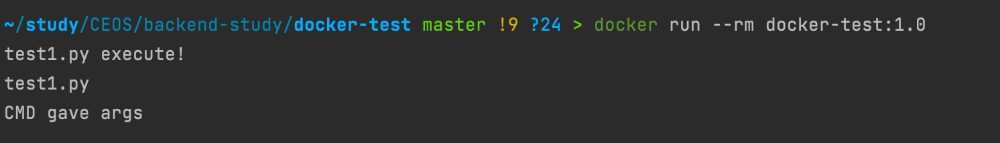
인자를 아무것도 주지 않았을 때  
**CMD gave args**가 출력된다.

<br>


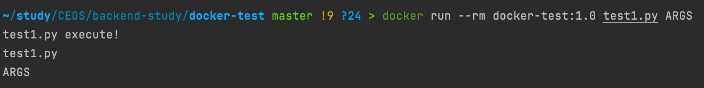
인자를 test1.py ARGS 2개 주었을 때  
**ARGS**가 출력된다.

<br>

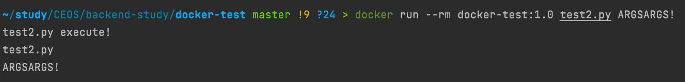
인자를 test2.py ARGSARGS! 2개 주었을 때  
**ARGSARGS!**가 출력된다.

<br>

앞서 예상했던 것과 같이 아무 인자도 주지 않았을 땐, `CMD`가 실행되어서 CMD gave args 라는 출력을 볼 수 있었다.  

인자를 주었을 땐, `CMD` 부분이 오버라이딩 되어서 출력되지 않고, 인자 부분이 출력되는 것을 볼 수 있다.

```yaml
#docker-compose.prod.yml
web:
    container_name: web
    build:
      context: ./
      dockerfile: Dockerfile.prod
    command: gunicorn django-rest-framework-14th.wsgi:application --bind 0.0.0.0:8000
    entrypoint:
      - sh
      - config/docker/entrypoint.prod.sh
      
    ...
    
```


## 서버 및 컨테이너에 접속하기

앞으로 서버에 접속하게될일이 많을 것 같아 간단하게 shell script 파일로 만들었다.
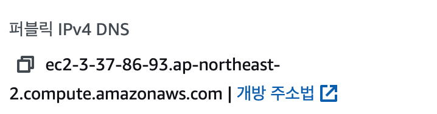

```shell
#!/bin/bash

ssh -i {pem 파일 위치} ubuntu@{퍼블릭 IPv4 DNS}
```

ssh로 ec2 서버에 접속이 가능하다.

ec2 서버에 docker를 이용하여 서버를 구동하기 때문에, 먼저 터미널에
```shell
> sudo docker ps
```

를 입력하여 구동되고 있는 컨테이너들을 확인한다.

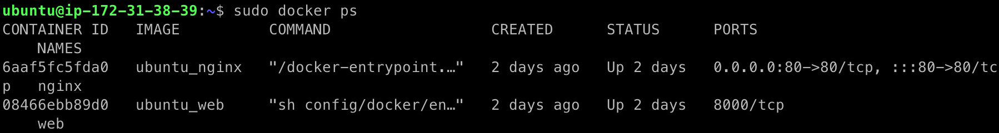

접속하고 싶은 컨테이너의 이름이 web이므로 다음과 같이 명령어를 입력한다.

```shell
> sudo docker exec -it web sh
```

**접속완료!**

## GITHUB WORKSPACE

승우님과 경준님 질문을 통해 `github action`의 동작과정을 조금 더 자세하게 알게됐다

```yaml
run: |
        touch .env
        echo "${{ secrets.ENV_VARS }}" >> .env
```

1. 이 touch를 하였을 때, .env 파일은 어디에 생기는 것일까?

```yaml
 name: create remote directory
      uses: appleboy/ssh-action@master
      with:
        host: ${{ secrets.HOST }}
        username: ubuntu
        key: ${{ secrets.KEY }}
        script: mkdir -p /home/ubuntu/srv/ubuntu
```

2. 왜 create remote directory step에선 ssh를 이용해서 디렉토리를 생성할까?

<br>
<br>

```yaml
# deploy.yml
name: Deploy to EC2
on: [push]
jobs:
```

push를 할 때 이 야믈에 설정된 `job`들이 실행된다. `job`은 `step`들이 모인 것이며 하나의 `job`내에선 같은 [runner](https://github.com/actions/runner) 에서 실행된다.  
이 `runner`는 `github`에서 제공하는 것과 개인의 것 두가지로 나눌 수 있는데, 우리는 `github`에서 제공하는 `runner`를 사용한다.  

`github`에서 제공하는 `runner`는 `github`가 호스팅하는 가상머신을 뜻하며, 실제로 어떻게 돌아가는지 알고싶어서 `deploy.yml`의 기존 step들을 수정한 뒤, workflow를 들여다 보았다.  

pwd와 ls -al 명령어를 사용하여 실제 어디서 동작하는지 보았다.  

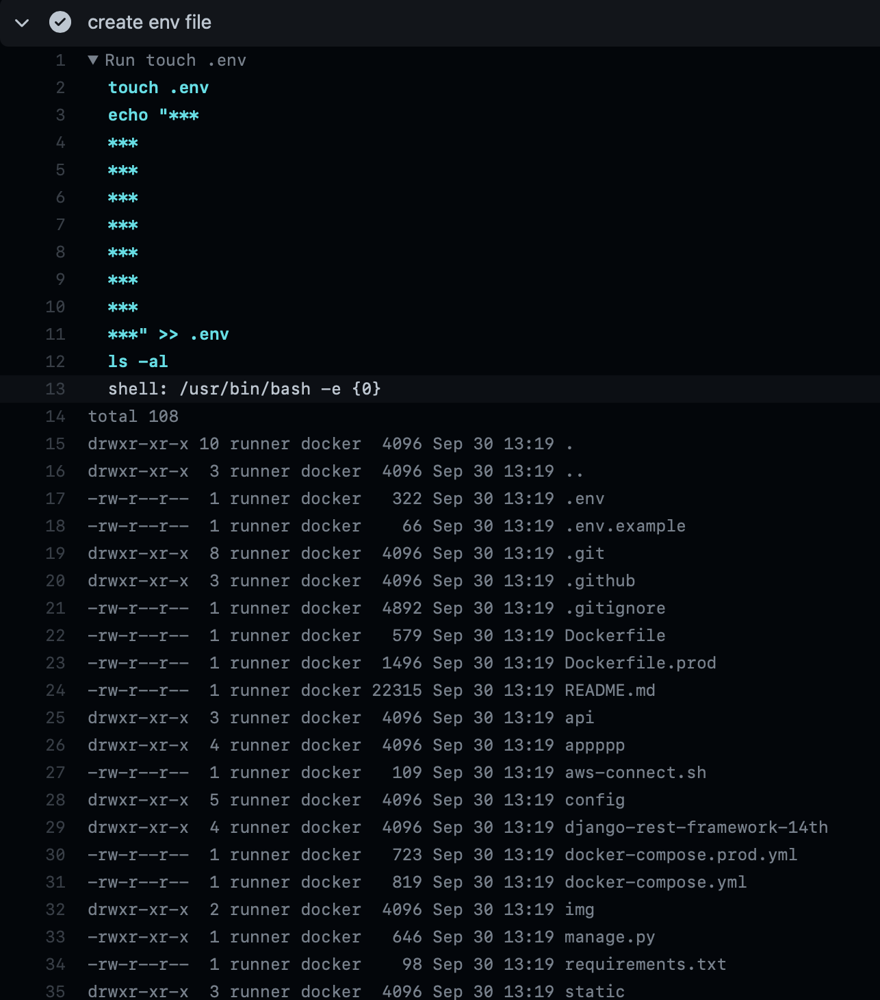

현재 `django-rest-framework-14th` repository에 있는 파일들이 전부 있는 것을 확인할 수 있다. 여기에 touch .env를 입력하였기 때문에, .env 파일이 추가되었다.  

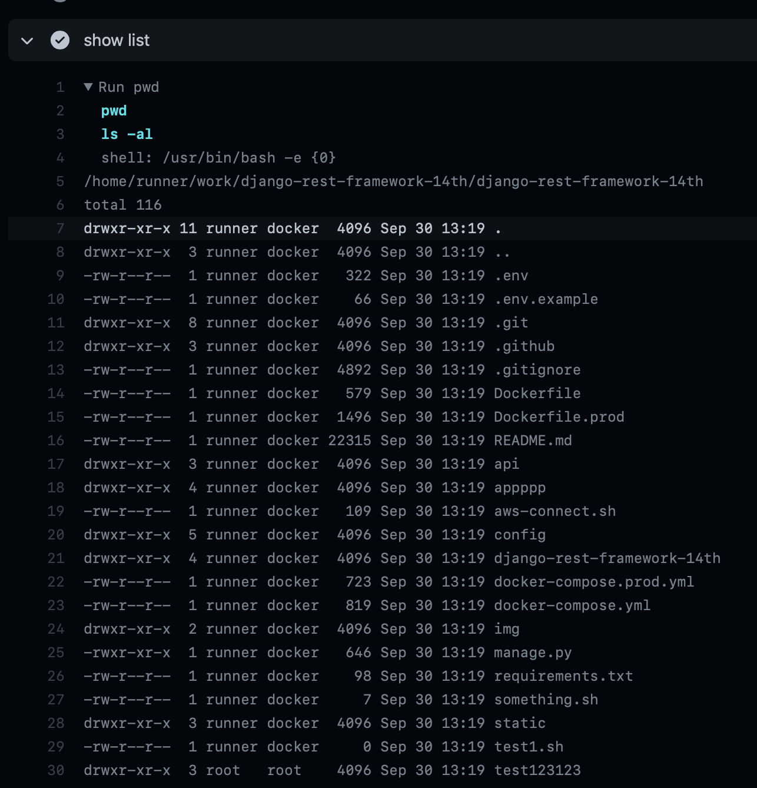

.env 파일이 만들어진 뒤, 이 디렉토리의 위치와 이 디렉토리에 존재하는 파일들을 보여주는 사진이다.  

**/home/runner/work/django-rest-framework-14th/django-rest-framework-14th**

가상환경에 repository에 존재하는 모든 파일들이 올라간 뒤, 그 곳에서 작업하는 것을 실제로 볼 수 있었다.

1번 질문의 답은 runner의 인스턴스에 repository의 모든 파일들이 업로드 되고, 그 곳에서 .env 파일도 생성된다 라고 할 수 있겠다.  

2번 질문의 답도 이 runner 인스턴스에 대한 이해를 마치고 나니, 간단하게 답변할 수 있었다.  

먼저 

```yaml
run: mkdir -p {directory} 
```

를 이용해서 디렉토리를 생성한다면, `runner` 인스턴스내에 새로운 디렉토리를 생성하는 것이다.  

`runner`인스턴스 내부가 아닌, ec2 인스턴스에 새로운 디렉토리를 생성하고 싶다면 다음과 같이 `ssh`를 사용하여 만들어야 한다.  

```yaml
- name: create remote directory
      uses: appleboy/ssh-action@master
      with:
        host: ${{ secrets.HOST }}
        username: ubuntu
        key: ${{ secrets.KEY }}
        script: mkdir -p /home/ubuntu/srv/ubuntu
```

`ssh`를 이용하게되면 `runner` 인스턴스와는 전혀 상관 없이 직접 ec2 인스턴스에 접속하여 mkdir 명령을 수행하는 것이기 때문이다!


<br>
<br>

# 결론
docker와 git action에 대해 굉장히 자세하게 알게되어서 굉장히 기분이 좋다.  
강해진 느낌이 든다.

<br>
<br>

# Reference
https://subicura.com/2017/01/19/docker-guide-for-beginners-1.html  

https://stackoverflow.com/questions/21553353/what-is-the-difference-between-cmd-and-entrypoint-in-a-dockerfile

https://my-repo.tistory.com/31**

https://joont92.github.io/docker/volume-container-추가하기/

https://jay-ji.tistory.com/66

https://docs.docker.com/develop/develop-images/multistage-build/

https://docs.github.com/en/actions/learn-github-actions/understanding-github-actions

https://docs.github.com/en/actions/learn-github-actions/environment-variables


# 3주차

## Instagram Database Modeling

### 간단한 설명

인스타그램 서비스는 먼저 `user`의 `id`, `password`로 로그인을 하며, 로그인을 한 뒤엔 `user`의 `nickname`이 보이게 된다.  

`user`는 `post`를 `photo`, `video`와 함께 게시할 수 있으며, `post`에 `text`는 없어도 된다.  

`post`에 다른 `user`들을 `tag`할 수 있다. 또한 다른 `user`들이 `post`에 `like`를 누를 수 있다.  

각 `post`엔 `comment`들을 달 수 있다. `comment`도 `post`와 마찬가지로 다른 `user`를 `tag`할 수 있으며, `comment`에 `like`를 누를 수 있다.  

`post`와 `comment`엔 `hashtag`라는 기능이 존재한다. 이 `hashtag`를 `user`가 누르게 되면, `hashtag`를 단 다른 `post`들이나 `comment`들을 전부 볼 수 있다.

각 `user`들은 다른 `user`를 follow 할 수 있다.

### 연관관계 

`user`, `post`, `comment`, `like`, `hashtag`, `video`, `photo`, `tag` 들의 관계를 알아보자.

* `user`가 여러 `post` 쓸 수 있지만 한 `post`가 여러 `user` 에게 쓰이지 않으므로 `1 : N` 관계이다.    


* `user`가 여러 `comment` 쓸 수 있지만 한 `comment`가 여러 `user` 에게 쓰이지 않으므로 `1 : N` 관계이다.


* `post`가 여러 `video`, `photo`들을 사용할 수 있지만 `video`, `photo`가 여러 `post`들에게 올림받진 않으므로 `1 : N` 관계이다.  


* `post`와 `comment`는 여러 `like`를 받을 수 있지만 하나의 `like`는 여러 곳에 뿌려지지 못하므로 `1 : N` 관계이다.  


* `user`가 여러 곳에 `like`를 할 수 있지만 `like`의 주체는 `user` 한 명이므로 `1 : N` 관계이다.


* `post`가 여러 `hashtag`를 사용할 수 있고, `hashtag`도 여러 `post`를 나타낼 수 있으므로 `N : M` 관계이다.


* `post`엔 여러 `user`를 `tag` 할 수 있다. `user`들도 여러 `post`에 태그당할 수 있으므로 `N : M` 관계이다.  


* `user`는 여러 `user`를 `follow`할 수 있고, 여러 `user`에게 `follow` 당할 수 있다.


### 완성된 모델

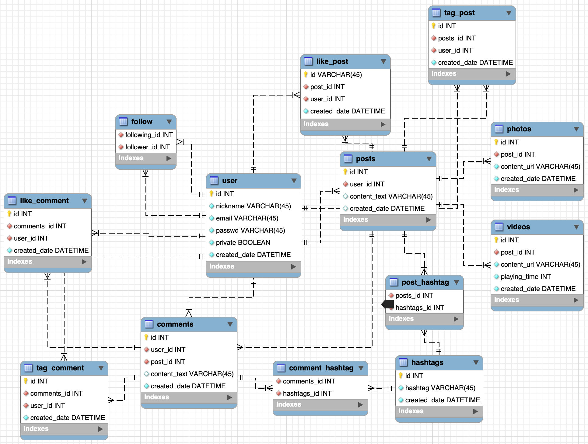
**ERD**
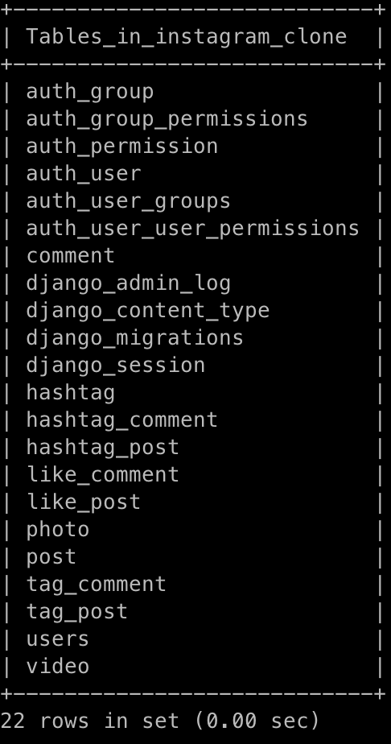
**TABLE**

<br>
<br>


**Profile**
```python
# models/profile.py

class Profile(models.Model):
    user = models.OneToOneField(User, on_delete=models.CASCADE)
    nickname = models.TextField(max_length=15)
    private = models.BooleanField(default=False)
    bio = models.TextField(max_length=300)
    image_url = models.TextField(max_length=300)

    class Meta:
        db_table = 'user'

    def __str__(self):
        return self.nickname

```
member 모델은 다음과 같이 만들었다.
user모델을 확장하였고, nickname, 비밀계정 여부, biography, 프로필사진 경로 들을 담는 컬럼들을 만들었다.  
Meta 클래스를 사용하여 자동 생성되는 테이블의 이름을 정하였다.

**Follow**
```python
# models/follow.py

class Follow(models.Model):
    following_id = models.ForeignKey(Profile, on_delete=models.CASCADE)
    follower_id = models.ForeignKey(Profile, on_delete=models.CASCADE)
    created_date = models.DateTimeField(auto_now_add=True)

    class Meta:
        db_table = 'follow'

    def when_created(self):
        return self.created_date.strftime('%Y-%m-%d %H:%M:%S')
```

user와 user끼리 n:m 관계라서 어떻게 해야하나 고민하다가 중간 테이블을 만드는것처럼 해서 만들었다.

**Post**
```python
# models/post.py

class Post(models.Model):
    id = models.AutoField(primary_key=True)
    user = models.ForeignKey(Profile, on_delete=models.CASCADE)
    content_text = models.TextField(max_length=300)
    created_date = models.DateTimeField(auto_now_add=True)
    update_date = models.DateTimeField(auto_now=True)

    class Meta:
        db_table = 'post'

    def __str__(self):
        return self.user.nickname + '의 게시물 :: ' + self.content_text

    def when_created(self):
        return self.created_date.strftime('%Y-%m-%d %H:%M:%S')

    def when_updated(self):
        return self.update_date.strftime('%Y-%m-%d %H:%M:%S')


class Video(models.Model):
    id = models.AutoField(primary_key=True)
    post = models.ForeignKey(Post, on_delete=models.CASCADE)
    content_url = models.TextField(max_length=300)
    playing_time = models.IntegerField()
    created_date = models.DateTimeField(auto_now_add=True)

    class Meta:
        db_table = 'video'

    def __str__(self):
        return self.content_url

    def when_created(self):
        return self.created_date.strftime('%Y-%m-%d %H:%M:%S')


class Photo(models.Model):
    id = models.AutoField(primary_key=True)
    post = models.ForeignKey(Post, on_delete=models.CASCADE)
    content_url = models.TextField(max_length=300)
    comment_block = models.BooleanField(default=False)
    created_date = models.DateTimeField(auto_now_add=True)

    class Meta:
        db_table = 'photo'

    def __str__(self):
        return self.content_url

    def when_created(self):
        return self.created_date.strftime('%Y-%m-%d %H:%M:%S')
```

Post의 경우 user와 1:N 관계이기 때문에, foreign key 설정을 해주었다. 또한 글을 쓸 수 있기 때문에 content_text 컬럼도 만들었다.  
생성, 변경 날짜를 기록하기 위해 created_date, update_date를 만들었다.  
더 편하게 조회하기 위해 날짜 조회 메서드들을 만들었다.


**Comment**
```python
# models/comment.py

class Comment(models.Model):
    id = models.AutoField(primary_key=True)
    user = models.ForeignKey(Member, on_delete=models.CASCADE)
    post = models.ForeignKey(Post, on_delete=models.CASCADE)
    content_text = models.TextField(max_length=300)
    created_date = models.DateTimeField(auto_now=True)

    class Meta:
        db_table = 'comment'

    def __str__(self):
        return self.user.nickname + ' says ' + self.content_text

    def when_created(self):
        return self.created_date.strftime('%Y-%m-%d %H:%M:%S')
```

이것도 머.. user와 1:N 관계라 foreign key 설정하였고, post와도 1:N 관계이므로 Foreign key 설정하였다.


**Like**

```python
# models/like.py

class LikeComment(models.Model):
    id = models.AutoField(primary_key=True)
    comment = models.ForeignKey(Comment, on_delete=models.CASCADE)
    user = models.ForeignKey(Profile, on_delete=models.CASCADE)
    created_date = models.DateTimeField(auto_now_add=True)

    class Meta:
        db_table = 'like_comment'

    def when_created(self):
        return self.created_date.strftime('%Y-%m-%d %H:%M:%S')


class LikePost(models.Model):
    id = models.AutoField(primary_key=True)
    post = models.ForeignKey(Post, on_delete=models.CASCADE)
    user = models.ForeignKey(Profile, on_delete=models.CASCADE)
    created_date = models.DateTimeField(auto_now_add=True)

    class Meta:
        db_table = 'like_post'

    def when_created(self):
        return self.created_date.strftime('%Y-%m-%d %H:%M:%S')

```

LikePost, LikeComment가 중복이 많다. 하나의 테이블로 합치고, type을 받을까 했지만 일단 이렇게 했다. post와 user를 fk로 설정했다.

**Hashtag**

```python
# models/hashtag.py

class Hashtag(models.Model):
    id = models.AutoField(primary_key=True)
    hashtag = models.TextField(max_length=30)
    created_date = models.DateTimeField(auto_now_add=True)

    class Meta:
        db_table = 'hashtag'

    def __str__(self):
        return self.hashtag

    def when_created(self):
        return self.created_date.strftime('%Y-%m-%d %H:%M:%S')


class HashtagComment(models.Model):
    hashtag = models.ForeignKey(Hashtag, on_delete=models.CASCADE)
    comment = models.ForeignKey(Comment, on_delete=models.CASCADE)

    class Meta:
        db_table = 'hashtag_comment'


class HashtagPost(models.Model):
    hashtag = models.ForeignKey(Hashtag, on_delete=models.CASCADE)
    post = models.ForeignKey(Post, on_delete=models.CASCADE)

    class Meta:
        db_table = 'hashtag_post'
```

hashtag와 comment가 n:m 관계이기 때문에, 중간에 HashtagComment 테이블을 만들어 1:N 관계로 풀어주었다.  
마찬가지로 hashtag와 post도 n:m 관계이기 때문에 1:n 관계로 만들어주기 위해 HashtagPost 테이블을 만들었다.


**Tag**
```python
# models/tag.py

class TagPost(models.Model):
    id = models.AutoField(primary_key=True)
    post = models.ForeignKey(Post, on_delete=models.CASCADE)
    user = models.ForeignKey(Profile, on_delete=models.CASCADE)
    created_date = models.DateTimeField(auto_now=True)

    class Meta:
        db_table = 'tag_post'

    def when_created(self):
        return self.created_date.strftime('%Y-%m-%d %H:%M:%S')


class TagComment(models.Model):
    id = models.AutoField(primary_key=True)
    comment = models.ForeignKey(Comment, on_delete=models.CASCADE)
    user = models.ForeignKey(Profile, on_delete=models.CASCADE)
    created_date = models.DateTimeField(auto_now=True)

    class Meta:
        db_table = 'tag_comment'

    def when_created(self):
        return self.created_date.strftime('%Y-%m-%d %H:%M:%S')
```

tag와 comment, tag와 post가 각각 n:m 관계라서 이렇게 풀어주었다.


### ORM 쿼리 이용하기

1. 데이터베이스에 해당 모델 객체 넣기 

```python
for i in range(0, 10):

    # user 생성
    name = 'user' + str(randint(1, 100000))
    email = name + '@gmail.com'
    pwd = name + 'pwd'
    user = User.objects.create_user(username=name, email=email, password=pwd)
    user.save()

    # member 생성
    nickname_list = ['Yu', 'Park', 'Lee', 'Woo', 'Choi', 'Smith', 'Kane', 'Son', 'Pierre', 'Henry', 'Messi', 'Ronaldo']
    nickname_cand = nickname_list[randint(0, 11)]

    if Member.objects.filter(nickname=nickname_cand).count() != 0: continue

    nickname = nickname_cand
    member = Member(nickname=nickname, user=user)
    member.save()

for i in range(0, 5):
    
    # user 선택
    user = Member.objects.all()[randint(0, Member.objects.all().count() - 1)]

    # post 저장
    post_text_list = ['차돌짬뽕', '삼선짬뽕', '홍합짬뽕']
    post = Post(user=user, content_text=str(randint(1, 100)) + "번째 " + post_text_list[randint(0, 2)])

    photo = Photo(post=post, content_url='https://image/' + post.content_text)

    post.save()
    photo.save()

    # save는 순차적으로 이루어져야함 member -> post -> photo

    comment_list = ['맛있겠네요!', '이상하게 생겼어요', '으윽 이게먼가요', '존맛탱', '오늘 피곤하네', '배고프다']
    comment_user = Member.objects.all()[randint(0, Member.objects.all().count() - 1)]
    comment = Comment(user=comment_user, post=post, content_text=comment_list[randint(0, 5)])

    comment.save()
```

`script.py`를 다음과 같이 작성하여 저장하였다.


```shell
> python script.py
```

`mysql`에서 조회한 결과는 다음과 같다.

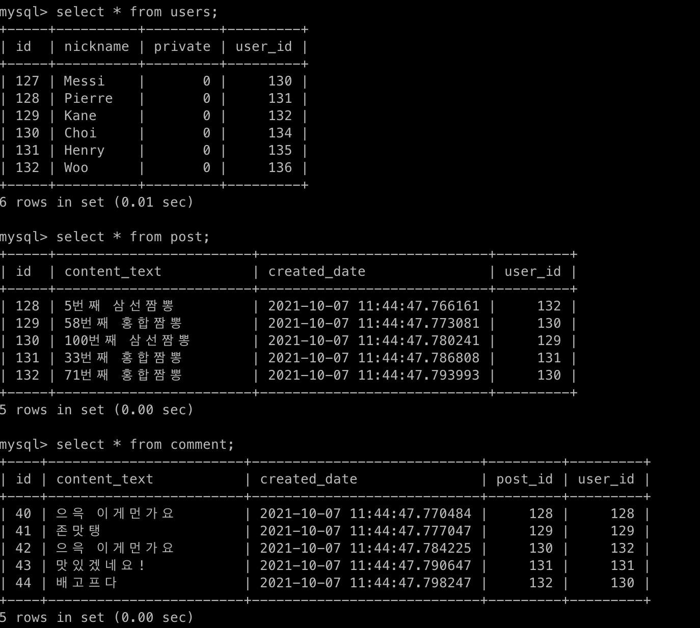

데이터가 잘 삽입된 것을 확인할 수 있다.

2. 삽입한 객체들을 `queryset`으로 조회해보기 (단, 객체들이 객체의 특성을 나타내는 구분가능한 이름으로 보여야 함)

```python
>>> Member.objects.all()
<QuerySet [<Member: Messi>, <Member: Pierre>, <Member: Kane>, <Member: Choi>, <Member: Henry>, <Member: Woo>]>
>>> Post.objects.all()
<QuerySet [<Post: Woo의 게시물 :: 5번째 삼선짬뽕>, <Post: Choi의 게시물 :: 58번째 홍합짬뽕>, <Post: Kane의 게시물 :: 100번째 삼선짬뽕>, <Post: Henry의 게시물 :: 33번째 홍합짬뽕>, <Post: Choi의 게시물 :: 71번째 홍합짬뽕>]>
>>> Comment.objects.all()
<QuerySet [<Comment: Pierre says 으윽 이게먼가요>, <Comment: Kane says 존맛탱>, <Comment: Woo says 으윽 이게먼가요>, <Comment: Henry says 맛있겠네요!>, <Comment: Choi says 배고프다>]>
>>> 

```

`python shell`로 진입하였다. `post`와 `comment`를 쿼리셋으로 조회한 결과는 다음과 같다.

3. `filter` 함수 사용해보기

```python

>>> choi = Member.objects.filter(nickname='Choi').first()
>>> messi = Member.objects.filter(nickname='Messi').first()
>>> kane = Member.objects.filter(nickname='Kane').first()

# 단어로 검색
>>> Post.objects.filter(content_text__contains='차돌')
<QuerySet []>
>>> Post.objects.filter(content_text__contains='홍합')
<QuerySet [<Post: Choi의 게시물 :: 58번째 홍합짬뽕>, <Post: Henry의 게시물 :: 33번째 홍합짬뽕>, <Post: Choi의 게시물 :: 71번째 홍합짬뽕>]>
>>> Post.objects.filter(content_text__contains='짬뽕')
<QuerySet [<Post: Woo의 게시물 :: 5번째 삼선짬뽕>, <Post: Choi의 게시물 :: 58번째 홍합짬뽕>, <Post: Kane의 게시물 :: 100번째 삼선짬뽕>, <Post: Henry의 게시물 :: 33번째 홍합짬뽕>, <Post: Choi의 게시물 :: 71번째 홍합짬뽕>]>

# 작성자로 검색
>>> Post.objects.filter(user=choi)
<QuerySet [<Post: Choi의 게시물 :: 58번째 홍합짬뽕>, <Post: Choi의 게시물 :: 71번째 홍합짬뽕>]>
>>> Comment.objects.filter(user=choi)
<QuerySet [<Comment: Choi says 배고프다>]>
>>> Comment.objects.filter(user=messi)
<QuerySet []>
>>> Comment.objects.filter(user=kane)
<QuerySet [<Comment: Kane says 존맛탱>]>

```

`filter` 함수를 사용한 결과는 위와 같다. `filter`로 조회한 객체는 갯수가 1개이더라도 `queryset`이므로 다룰 때 주의해야한다.

### 회고

`mysqlclient` 설치부터 시작해서 오류 발생에.. `shell`에서 `import` 안되고.. 너무 많은 오류들 때문에 힘들었다.  

그래도 직접 db 설계 해보니까 재밌었고 좋은 경험이었다.

`python` 이란 언어를 처음 써보니까 '이건 왜 안되지?' 라는 경우가 좀 많았던 것 같다.  

조금 더 익숙해지면 괜찮을 것 같다.


# 4주차

## 3주차 피드백 반영

app을 나눠서 모델들을 전부 다시 구성했다. 만들어진 테이블들은 다음과 같다.
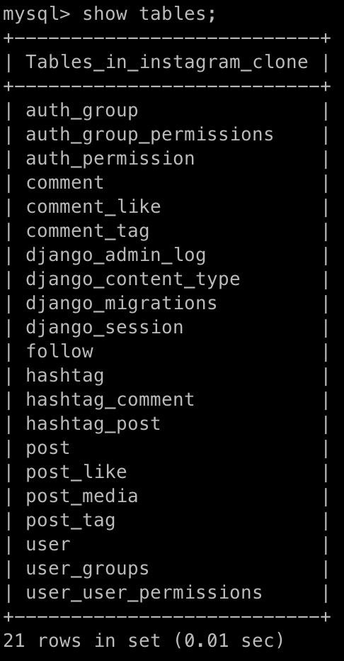

모델에 좀 더 쉽게 조회할 수 있도록 메서드들도 추가했다.

```python
# user/models.py

class User(AbstractBaseUser, PermissionsMixin):
    
    # field 생략
    
    def get_all_posts(self):
        return self.post.all()

    def get_all_comments(self):
        return self.comment.all()

    def get_all_followers(self):
        return self.follower.all()

    def get_followers_count(self):
        return self.get_all_followers().count()

    def get_all_followings(self):
        return self.following.all()

    def get_followings_count(self):
        return self.get_all_followings().count()

    def is_following(self, to_user):
        try:
            self.following.get(to_user=to_user)

        except Follow.DoesNotExist:
            return False

        return True

    def is_followed(self, from_user):
        try:
            self.follower.get(from_user=from_user)

        except self.DoesNotExist:
            return False

        return True

```
그런데 이렇게 모델에 메서드들을 많이 사용해도 되는지 모르겠다.
아직 장고의 컨벤션들을 잘 몰라서 이런 부분들이 좀 어려운 것 같다.

## 1. 데이터 삽입

***User Model***
```python
class User(AbstractBaseUser, PermissionsMixin):
    id = models.AutoField(primary_key=True)
    login_id = models.CharField(max_length=255, unique=True, null=False, blank=False)
    email = models.EmailField(max_length=50, unique=True, null=False, blank=False)
    nickname = models.CharField(max_length=30, unique=True, null=False, blank=False)
    bio = models.TextField(blank=True)
    profile_picture = models.ImageField(upload_to='', blank=True)

    is_private = models.BooleanField(default=False)
    is_active = models.BooleanField(default=True)
    is_superuser = models.BooleanField(default=False)

    created_date = models.DateTimeField(auto_now_add=True, editable=False)

    objects = UserManager()

    USERNAME_FIELD = 'nickname'
    REQUIRED_FIELDS = ['login_id', 'email']

    class Meta:
        db_table = 'user'

    def __str__(self):
        return self.nickname

    def get_all_posts(self):
        return self.post.all()

    def get_all_comments(self):
        return self.comment.all()

    def get_all_followers(self):
        return self.follower.all()

    def get_followers_count(self):
        return self.get_all_followers().count()

    def get_all_followings(self):
        return self.following.all()

    def get_followings_count(self):
        return self.get_all_followings().count()

    def is_following(self, to_user):
        try:
            self.following.get(to_user=to_user)

        except Follow.DoesNotExist:
            return False

        return True

    def is_followed(self, from_user):
        try:
            self.follower.get(from_user=from_user)

        except self.DoesNotExist:
            return False

        return True
```

***User Manager***
```python
class UserManager(BaseUserManager):
    def create(self, data):
        user = self.model(
            login_id=data['login_id'],
            email=data['email'],
            nickname=data['nickname']
        )

        password = data.get('password')
        user.set_password(password)

        user.save()
        return user

    def update(self, user, data):
        for key in data.keys():
            if not hasattr(user, key):
                raise AttributeError
            user.__setattr__(key, data[key])
        user.save()

    def delete(self, pk):
        user = User.objects.filter(pk=pk)
        if not user.exists():
            raise ValueError
        user.delete()

    def follow(self, from_user, to_user):
        if from_user.is_following(to_user):
            raise ValueError

        relation = Follow(from_user=from_user, to_user=to_user)
        relation.save()
```

이렇게 `UserManager`를 추가하여 

***Follow Model***
```python
class Follow(Base):
    from_user = models.ForeignKey('User', on_delete=models.CASCADE, related_name='following')
    to_user = models.ForeignKey('User', on_delete=models.CASCADE, related_name='follower')

    class Meta:
        db_table = 'follow'

    def __str__(self):
        return str(self.from_user.id) + ' follows ' + str(self.to_user.id)

```

***결과***   
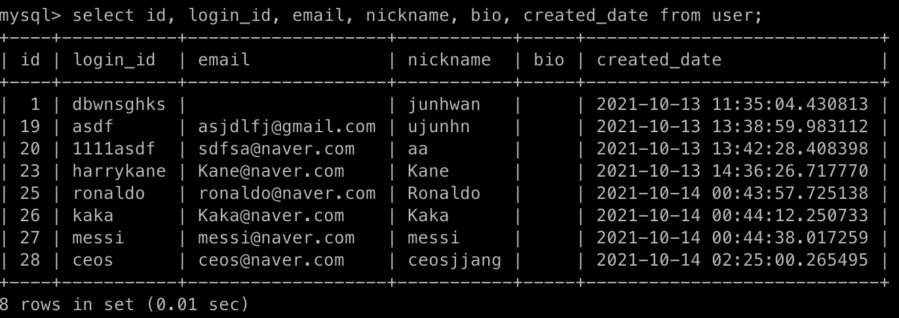


## 2. 모든 데이터를 가져오는 API 만들기
***모든 'User'의  list를 가져오는 API 요청 : /api/user GET***

***Code***
```python
@csrf_exempt
@api_view(['GET', 'POST'])
# /api/user
def user_list(request):
    # display all user list
    if request.method == 'GET':
        users = User.objects.all()
        fields = request.GET.getlist('fields') or None
        excludes = request.GET.getlist('excludes') or None

        try:
            serializer = UserSerializer(users, fields=fields, excludes=excludes, many=True)
        except ValueError:
            return JsonResponse({'message': 'Wrong url parameter : '
                                            'Fields and Excludes cannot exist at the same time'}, status=400)

        response = serializer.data
        return JsonResponse(response, status=200, safe=False)
```
fields와 excludes를 받아 원하는 필드들을 파라미터를 통해 동적으로 응답받을 수 있게 하였다.

***Result***

```json
[
    {
        "id": 1,
        "login_id": "dbwnsghks",
        "email": "",
        "nickname": "junhwan",
        "bio": "",
        "profile_picture": null,
        "following": [
            {
                "id": 11,
                "to_user": 23
            },
            {
                "id": 12,
                "to_user": 19
            },
            {
                "id": 13,
                "to_user": 20
            },
            {
                "id": 17,
                "to_user": 27
            }
        ],
        "follower": [
            {
                "id": 14,
                "from_user": 19
            },
            {
                "id": 15,
                "from_user": 20
            },
            {
                "id": 16,
                "from_user": 23
            }
        ],
        "is_private": false,
        "is_active": true,
        "is_superuser": false,
        "created_date": "2021-10-13T11:35:04.430813"
    },
    {
        "id": 19,
        "login_id": "asdf",
        "email": "asjdlfj@gmail.com",
        "nickname": "ujunhn",
        "bio": "",
        "profile_picture": null,
        "following": [
            {
                "id": 14,
                "to_user": 1
            }
        ],
        "follower": [
            {
                "id": 12,
                "from_user": 1
            }
        ],
        "is_private": false,
        "is_active": true,
        "is_superuser": false,
        "created_date": "2021-10-13T13:38:59.983112"
    },
    {
        "id": 20,
        "login_id": "1111asdf",
        "email": "sdfsa@naver.com",
        "nickname": "aa",
        "bio": "",
        "profile_picture": null,
        "following": [
            {
                "id": 15,
                "to_user": 1
            }
        ],
        "follower": [
            {
                "id": 13,
                "from_user": 1
            }
        ],
        "is_private": false,
        "is_active": true,
        "is_superuser": false,
        "created_date": "2021-10-13T13:42:28.408398"
    },
    {
        "id": 23,
        "login_id": "harrykane",
        "email": "Kane@naver.com",
        "nickname": "Kane",
        "bio": "",
        "profile_picture": null,
        "following": [
            {
                "id": 16,
                "to_user": 1
            }
        ],
        "follower": [
            {
                "id": 11,
                "from_user": 1
            }
        ],
        "is_private": false,
        "is_active": true,
        "is_superuser": false,
        "created_date": "2021-10-13T14:36:26.717770"
    },
    {
        "id": 25,
        "login_id": "ronaldo",
        "email": "ronaldo@naver.com",
        "nickname": "Ronaldo",
        "bio": "",
        "profile_picture": null,
        "following": [],
        "follower": [],
        "is_private": false,
        "is_active": true,
        "is_superuser": false,
        "created_date": "2021-10-14T00:43:57.725138"
    },
    {
        "id": 26,
        "login_id": "kaka",
        "email": "Kaka@naver.com",
        "nickname": "Kaka",
        "bio": "",
        "profile_picture": null,
        "following": [],
        "follower": [],
        "is_private": false,
        "is_active": true,
        "is_superuser": false,
        "created_date": "2021-10-14T00:44:12.250733"
    },
    {
        "id": 27,
        "login_id": "messi",
        "email": "messi@naver.com",
        "nickname": "messi",
        "bio": "",
        "profile_picture": null,
        "following": [],
        "follower": [
            {
                "id": 17,
                "from_user": 1
            }
        ],
        "is_private": false,
        "is_active": true,
        "is_superuser": false,
        "created_date": "2021-10-14T00:44:38.017259"
    },
    {
        "id": 28,
        "login_id": "ceos",
        "email": "ceos@naver.com",
        "nickname": "ceosjjang",
        "bio": "",
        "profile_picture": null,
        "following": [],
        "follower": [],
        "is_private": false,
        "is_active": true,
        "is_superuser": false,
        "created_date": "2021-10-14T02:25:00.265495"
    }
]
```

## 3. 새로운 데이터를 create하도록 요청하는 API 만들기
User를 추가하는 API 요청 결과 : /api/user POST 

***Body Data***

```json
{
    "login_id":"chasdfa",
    "email":"casfsdfha@naver.com",
    "nickname":"Chdfa",
    "password":"q1w2e3r4"
}
```


중복된 데이터 입력시 오류 검증
```json
{
    "login_id": [
        "user의 login id은/는 이미 존재합니다."
    ],
    "email": [
        "user의 email은/는 이미 존재합니다."
    ],
    "nickname": [
        "user의 nickname은/는 이미 존재합니다."
    ]
}
```
`serializer`에서 unique field들에 대한 중복값 검증을 알아서 해준다.  
안해주는지 알고 혼자 짰다가 다 지웠다..

## 지금까지 만든 API 정리

### /api/user GET
* 유저 전체 목록을 가져온다.
* 파라미터를 주어 원하는 필드의 데이터를 동적으로 가져올 수 있다.

***method: GET***  
***url: localhost:8000/api/user?fields=nickname&fields=created_date***
---
```json
[
    {
        "id": 1,
        "nickname": "junhwan",
        "created_date": "2021-10-13T11:35:04.430813"
    },
    {
        "id": 19,
        "nickname": "ujunhn",
        "created_date": "2021-10-13T13:38:59.983112"
    },
    {
        "id": 20,
        "nickname": "aa",
        "created_date": "2021-10-13T13:42:28.408398"
    },
    {
        "id": 23,
        "nickname": "Kane",
        "created_date": "2021-10-13T14:36:26.717770"
    },
    {
        "id": 25,
        "nickname": "Ronaldo",
        "created_date": "2021-10-14T00:43:57.725138"
    },
    {
        "id": 26,
        "nickname": "Kaka",
        "created_date": "2021-10-14T00:44:12.250733"
    },
    {
        "id": 27,
        "nickname": "messi",
        "created_date": "2021-10-14T00:44:38.017259"
    },
    {
        "id": 28,
        "nickname": "ceosjjang",
        "created_date": "2021-10-14T02:25:00.265495"
    },
    {
        "id": 29,
        "nickname": "Chdfa",
        "created_date": "2021-10-14T02:54:38.041593"
    }
]
```

### /api/user POST
* body data를 이용하여 유저를 생성한다.

### /api/user/{user_id} GET
* 특정 유저를 검색한다.  

***method: GET***  
***url: localhost:8000/api/user/23?fields=id&fields=email&fields=nickname&fields=created_date&fields=following&fields=follower***

---
```json
[
    {
        "id": 23,
        "email": "Kane@naver.com",
        "nickname": "Kane",
        "following": [
            {
                "id": 16,
                "to_user": 1
            }
        ],
        "follower": [
            {
                "id": 11,
                "from_user": 1
            }
        ],
        "created_date": "2021-10-13T14:36:26.717770"
    }
]
```

### /api/user/{user_id} PUT
* {user_id}에 해당하는 유저의 데이터를 body data로 바꾼다.  

***method: PUT***  
***url: localhost:8000/api/user/23***  

```python
# user/models.py
    def update(self, pk, data):
        user = User.objects.filter(pk=pk)
        if not user.exists():
            raise ValueError

        user = user.first()

        for key in data.keys():
            if not hasattr(user, key):
                raise AttributeError
            user.__setattr__(key, data[key])
        user.save()
```
유저 모델에 다음과 같은 메서드를 정의하였다.  

```python
# user/views.py
elif request.method == 'PUT':
    data = JSONParser().parse(request)

    try:
        User.objects.update(pk, data)

    except IntegrityError:
        return JsonResponse({"message": str(data) + " is already exist"}, status=304)
    except ValueError:
        return JsonResponse({"message": "Id " + str(pk) + " is not exist"}, status=304)
    except AttributeError:
        return JsonResponse({"message": str(data) + " have wrong attribute"}, stauts=304)

    return JsonResponse({"message": "Id " + str(pk) + ' is updated successfully'}, status=200)
```

이렇게 많은 예외들을 한번에 처리할 순 없을까?? 너무 번거롭다.

***body data***
```json
{
    "nickname":"Pogba"
}
```

***response***
```json
{
    "message": "Id 23 is updated successfully"
}
```

***result***

/api/user/23 GET으로 조회하였다.   
`nickname`이 Kane -> Pogba 로 변하였다.
```json
[
    {
        "id": 23,
        "login_id": "harrykane",
        "email": "Kane@naver.com",
        "nickname": "Pogba",
        "bio": "",
        "profile_picture": null,
        "following": [
            {
                "id": 16,
                "to_user": 1
            }
        ],
        "follower": [
            {
                "id": 11,
                "from_user": 1
            }
        ],
        "is_private": false,
        "is_active": true,
        "is_superuser": false,
        "created_date": "2021-10-13T14:36:26.717770"
    }
]

```

### /api/user/{user_id} DELETE
* user_id에 해당하는 유저를 지운다.

***method: DELETE***  
***url: localhost:8000/api/user/23***  

***response***
```json
{
    "message": "Id 23 is deleted successfully"
}
```

***result***
/api/user/23 으로 조회하였다. 성공적으로 삭제되었다.
```json
{
    "message": "Id 23 doesn't exist in database"
}
```

###/api/user/{from_user_id}/following/{to_user_id} GET

* {from_user_id}의 유저가 {to_user_id}를 팔로우 하는지 확인한다. 

***method: GET***  
***url: localhost:8000/1/user/27*** 

```python
# user/views.py

if from_user.is_following(to_user):
    return JsonResponse({"message": "True"}, status=200)
return JsonResponse({"message": "False"}, status=200)
```
개인적으로 이 부분이 말하는 것 처럼 써져서 제일 맘에 든다.

***response***
```json
{
    "message": "True"
}
```

***method: GET***  
***url: localhost:8000/1/user/2124*** 

***response***
```json
{
    "message": "id=1 user or id=2124 user does not exist in the database"
}
```

### /api/user/{from_user_id}/following/{to_user_id} PUT 

* {from_user_id}의 유저가 {to_user_id}를 팔로우한다.

```python
# user/models.py
def follow(self, from_user, to_user):
    if from_user.is_following(to_user):
        raise ValueError

    relation = Follow(from_user=from_user, to_user=to_user)
    relation.save()
```
유저 모델에 이렇게 메서드를 정의하였다.

### /api/user/{from_user_id}/following/{to_user_id} DELETE 
* {from_user_id}의 유저가 {to_user_id}를 언팔로우한다.


### /api/user/{user_id}/follower GET
* {user_id}의 유저를 팔로우하는 유저들의 목록이다.
* 이 부분은 수정이 필요해 보인다...

```python
# user/models.py
if request.method == 'GET':
    try:
        user = User.objects.get(pk=pk)

    except User.DoesNotExist:
        return JsonResponse({'message': '%s does not exist' % (str(pk))}, status=404)

    # 따져보면 맞는데.. 변수명이 너무너무 헷갈린다.
    user_followers = User.objects.filter(following__to_user=user)

    try:
        serializer = UserSerializer(
            user_followers,
            fields=('id', 'login_id', 'email', 'nickname', 'bio', 'profile_picture'),
            many=True
        )

    except ValueError:
        return JsonResponse({'message': 'Wrong url parameter : '
                                        'Fields and Excludes cannot exist at the same time'}, status=404)

    return JsonResponse(serializer.data, safe=False, status=200)
```
이 부분이 머리를 터지게 했다. 아직도 해결 못함

***method: GET***  
***url: localhost:8000/1/following

```json
[
    {
        "id": 19,
        "login_id": "asdf",
        "email": "asjdlfj@gmail.com",
        "nickname": "ujunhn",
        "bio": "",
        "profile_picture": null
    },
    {
        "id": 20,
        "login_id": "1111asdf",
        "email": "sdfsa@naver.com",
        "nickname": "aa",
        "bio": "",
        "profile_picture": null
    },
    {
        "id": 27,
        "login_id": "messi",
        "email": "messi@naver.com",
        "nickname": "messi",
        "bio": "",
        "profile_picture": null
    }
]
```

### /api/user/{user_id}/following GET
* {user_id}의 유저가 팔로우하는 유저들의 목록이다.
* 위랑 동일

## follow 관계 모델링 
`serializer` 를 이용하여 `follow` 관계를 살펴보려고 했다. 깊게 생각하지 않고 단순 직관적으로 구성했던 변수명들과 `related_name`들이 헷갈리게 했다.

`serializer`와 결과는 다음과 같다.

```python
# serializer

class UserSerializer(serializers.ModelSerializer):
    follower = FollowerSerializer(many=True, read_only=True)
    following = FollowingSerializer(many=True, read_only=True)

    class Meta:
        model = User
        fields = ['id', 'username', 'nickname', 'bio', 'profile_picture', 'is_private', 'is_active', 'following',
                  'follower']
```

```json
//result

{
   "id":11,
   "username":"user78442",
   "nickname":"Ronaldo",
   "bio":"",
   "profile_picture":null,
   "is_private":false,
   "is_active":true,
   "following":[
      {
         "id":3,
         "created_date":"2021-10-12T09:40:52.933096",
         "update_date":"2021-10-12T09:40:52.933212",
         "following_user":11,
         "follower_user":7
      },
      {
         "id":13,
         "created_date":"2021-10-12T09:46:51.713116",
         "update_date":"2021-10-12T09:46:51.713149",
         "following_user":11,
         "follower_user":7
      },
      {
         "id":14,
         "created_date":"2021-10-12T09:46:51.738402",
         "update_date":"2021-10-12T09:46:51.738451",
         "following_user":11,
         "follower_user":5
      },
      {
         "id":16,
         "created_date":"2021-10-12T09:46:53.456473",
         "update_date":"2021-10-12T09:46:53.456508",
         "following_user":11,
         "follower_user":3
      }
   ],
   "follower":[
      {
         "id":8,
         "created_date":"2021-10-12T09:46:50.080478",
         "update_date":"2021-10-12T09:46:50.080515",
         "following_user":1,
         "follower_user":11
      }
   ]
}

```

관계를 확실하게 보기위해 `nested serializer` 를 사용하여 Json으로 만들었는데, 너무너무 헷갈린다.  
follower에 following_user와 follower_user 라는 변수명으로 들어있다보니 바로 눈에 들어오지 않았다.  

방향을 기준으로 잡으면 좋을 것 같다는 생각이 들어 이렇게 해보았다.
> from_user -> to_user

`relation_name`이 문제였다. 이 부분이 조금 어려웠다.
from_user는 to_user를 팔로우한다.  

`user.following.all()`으로 user의 팔로잉목록을 불렀을 때,  
from_user_id = user_id 인 객체들이 불러져야한다.

그러므로 from_user의 relation_name은 'following', to_user의 relation_name은 'follower' 이다.  
코드로 나타내면 다음과 같다.

```python
class Follow(Base):
    from_user = models.ForeignKey('User', on_delete=models.CASCADE, related_name='following')
    to_user = models.ForeignKey('User', on_delete=models.CASCADE, related_name='follower')
```

json으로 만든 Ronaldo씨의 UserSerializer 결과는 다음과 같다.  
직관적으로 잘 만들어졌다고 생각한다.

```json
{
   "id":2,
   "username":"user40958",
   "nickname":"Ronaldo",
   "bio":"",
   "profile_picture":null,
   "is_private":false,
   "is_active":true,
   "following":[
      {
         "id":42,
         "to_user":6
      }
   ],
   "follower":[
      {
         "id":3,
         "from_user":5
      },
      {
         "id":6,
         "from_user":3
      },
      {
         "id":8,
         "from_user":7
      },
      {
         "id":25,
         "from_user":7
      },
      {
         "id":26,
         "from_user":1
      }
   ]
}
```

## serializer.data를 JsonResponse에 넣었을 때 발생하는 오류

```python
# django.http.response.py

def __init__(self, data, encoder=DjangoJSONEncoder, safe=True,
             json_dumps_params=None, **kwargs):
    if safe and not isinstance(data, dict):
        raise TypeError(
            'In order to allow non-dict objects to be serialized set the '
            'safe parameter to False.'
        )

```
`dict` 자료형이 아닐 때, `safe`를 `False`로 해놓지 않으면, `TypeError`가 발생하게 된다.

```python
return JsonResponse(serializer.data, safe=False)
```

이거 때문에 시간 many 날렸다. 

## DynamicFieldsModelSerializer

* 동적으로 필드들을 조회하고 싶을 때 사용한다.

```python
class DynamicFieldsModelSerializer(ModelSerializer):
    def __init__(self, *args, **kwargs):
        fields = kwargs.pop('fields', None)
        excludes = kwargs.pop('excludes', None)

        if fields is not None and excludes is not None:
            raise ValueError

        super(DynamicFieldsModelSerializer, self).__init__(*args, **kwargs)

        if fields is not None:
            allowed = set(fields)
            existing = set(self.fields)
            for field_name in existing - allowed:
                self.fields.pop(field_name)

        elif excludes is not None:
            not_allowed = set(excludes)
            for exclude_name in not_allowed:
                self.fields.pop(exclude_name)   

class UserSerializer(DynamicFieldsModelSerializer):
    follower = FollowerSerializer(many=True, read_only=True)
    following = FollowingSerializer(many=True, read_only=True)

    class Meta:
        model = User
        fields = [
            'id', 'login_id', 'email',
            'nickname', 'bio', 'profile_picture',
            'following', 'follower',
            'is_private', 'is_active', 'is_superuser',
            'created_date'
        ]
```

위와같이 `UserSerializer`가 `DynamicFieldsModelSerializer`를 상속한다.
`fields`에 해당하는 필드들만 serialize 되어 반환된다.

이렇게 사용하였다.

```python
if request.method == 'GET':
    users = User.objects.all()
    # GET parameter를 여기서 받는다.
    fields = request.GET.getlist('fields') or None
    excludes = request.GET.getlist('excludes') or None

    try:
        serializer = UserSerializer(users, fields=fields, excludes=excludes, many=True)
    except ValueError:
        return JsonResponse({'message': 'Wrong url parameter : '
                                        'Fields and Excludes cannot exist at the same time'}, status=400)

    response = serializer.data
    return JsonResponse(response, status=200, safe=False)
```

이렇게 parameter에서 받아준 fields를 serializer에 fields인자로 넣어주면 해당 필드들만 반환된다!

결과  

***method: GET***  
***url: localhost:8000/api/user?fields=nickname&fields=created_date***
---
```json
[
    {
        "id": 1,
        "nickname": "junhwan",
        "created_date": "2021-10-13T11:35:04.430813"
    },
    {
        "id": 19,
        "nickname": "ujunhn",
        "created_date": "2021-10-13T13:38:59.983112"
    },
    {
        "id": 20,
        "nickname": "aa",
        "created_date": "2021-10-13T13:42:28.408398"
    },
    {
        "id": 23,
        "nickname": "Kane",
        "created_date": "2021-10-13T14:36:26.717770"
    },
    {
        "id": 25,
        "nickname": "Ronaldo",
        "created_date": "2021-10-14T00:43:57.725138"
    },
    {
        "id": 26,
        "nickname": "Kaka",
        "created_date": "2021-10-14T00:44:12.250733"
    },
    {
        "id": 27,
        "nickname": "messi",
        "created_date": "2021-10-14T00:44:38.017259"
    },
    {
        "id": 28,
        "nickname": "ceosjjang",
        "created_date": "2021-10-14T02:25:00.265495"
    },
    {
        "id": 29,
        "nickname": "Chdfa",
        "created_date": "2021-10-14T02:54:38.041593"
    }
]
```

## N+1 problem

```python
# user/serializer.py

class UserSerializer(DynamicFieldsModelSerializer):
    follower_nickname = SerializerMethodField()
    following_nickname = SerializerMethodField()

    def get_follower_nickname(self, obj):
        # obj == User
        print("########## FOLLOWER START ##########")
        followers = obj.follower.select_related('from_user').all()
        ret = [follower.from_user.nickname for follower in followers]
        print("########## FOLLOWER DONE ##########")
        return ret

    def get_following_nickname(self, obj):
        print("########## FOLLOWING START ##########")
        followings = obj.following.all()
        ret = [following.to_user.nickname for following in followings]
        print("########## FOLLOWING DONE ##########")
        return ret

```

follower는 select_related를 넣어주어 eager하게 가져왔고, following은 그냥 lazy하게 가져온다.  
이 때 나가는 쿼리는 다음과 같다.

* get_follower_nickname SQL query
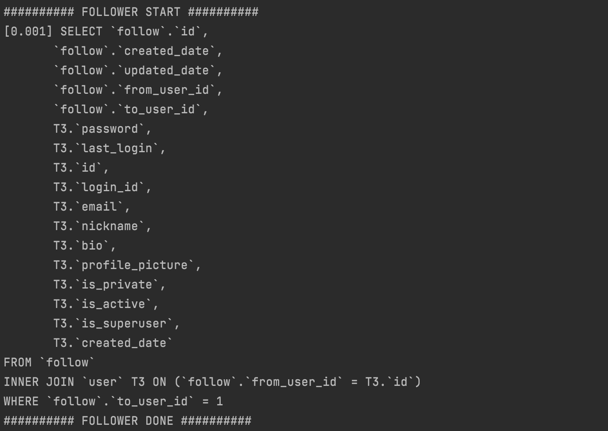

* get_following_nickname SQL query
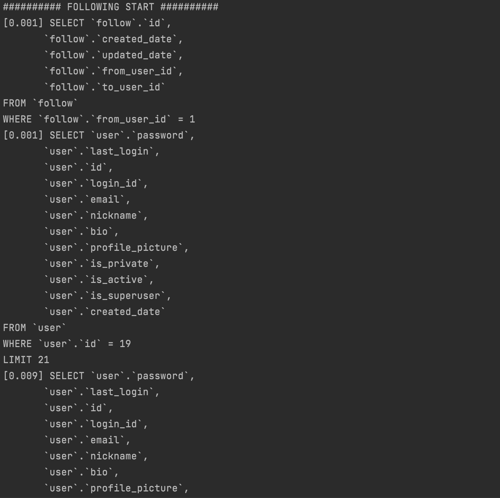
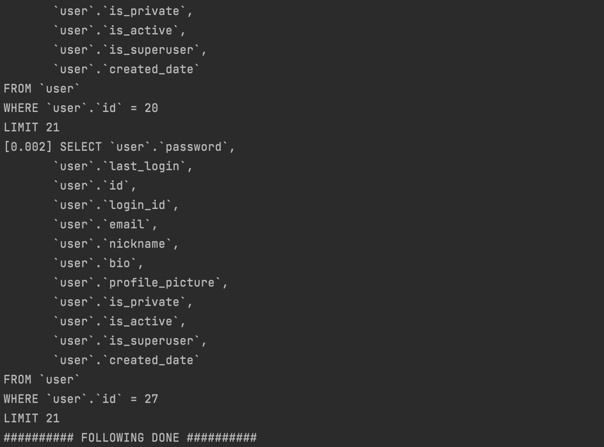

`following`을 가져왔지만, `user`의 필드를 참조하니까 `user`를 찾는 쿼리가 for문을 돌며 매번 발생한다.  
만약 following이 1000개였다면, 쿼리는 1000번 발생했을 것이다. 

`follower`의 닉네임을 가져올 때는 다르다. `inner join`을 통해 한번에 가져오는 것을 알 수 있다.  
따라서, 역참조를 할 땐 `select_related()` 를 사용하여 쿼리를 최적화 해야겠다.


## 회고

이번주는 일이 많아서 너무 힘들었다.... 
아직도 `python`에 익숙치 않아, 자료형에서 자꾸 헤멘다.  

팔로우 기능이 어려워보여서 만들어보고 싶었는데 잘 돼서 좋다.  
나름 예외처리도 잘 한것 같다. 그래도 아직은 체계가 안잡힌 느낌이다.   
잘 짜여진 장고 프로젝트를 보고 모델이나 뷰들을 어떻게 구성했는지 보고싶다.  

instagram의 과거 api를 보니, token을 이용하여 팔로우 기능을 구성하였던 것 같다.  
token 사용하면 그 때 리팩토링 해야겠다..

## reference
https://docs.djangoproject.com/en/3.2/topics/auth/customizing/
https://docs.djangoproject.com/en/3.2/ref/models/querysets/
https://www.django-rest-framework.org/api-guide/serializers/
https://developer.twitter.com/en/docs/twitter-api
https://docs.github.com/en/rest/reference/users


## 5주차 과제
### 모든 list를 가져오는 API
<!-- API 요청한 URL과 결과 데이터를 코드로 보여주세요! -->

* Method : `GET`
* URL : `/api/user`

```python
# Model: USER
def get(self, request, pk=None, **kwargs):
    fields = request.GET.getlist('fields') or None
    if pk is None:
        users = User.objects.all()

        try:
            serializer = UserSerializer(users, fields=fields, many=True)
            return JsonResponse(serializer.data, status=200, safe=False)
        except ValueError:
            return JsonResponse({'message': 'Wrong url parameter'})

```

* 모든 유저들을 가져오는 API 결과: `/api/user` `GET`

```yaml
[
    {
        "id": 4,
        "login_id": "nkjljl",
        "email": "son@naver.com",
        "nickname": "asdf",
        "bio": "",
        "profile_picture": null,
        "follower_nickname": [
            "leela"
        ],
        "following_nickname": [
            "nasungcity"
        ],
        "is_private": false,
        "is_active": true,
        "is_superuser": false,
        "created_date": "2021-11-08T16:51:26.938795"
    },
    {
        "id": 5,
        "login_id": "151515asf315",
        "email": "so3n@naver.com",
        "nickname": "asfxzcvxcv",
        "bio": "",
        "profile_picture": null,
        "follower_nickname": [
            "leela"
        ],
        "following_nickname": [
            "nasungcity"
        ],
        "is_private": false,
        "is_active": true,
        "is_superuser": false,
        "created_date": "2021-11-08T17:23:34.467783"
    },
    {
        "id": 6,
        "login_id": "15151515135sf315",
        "email": "so3n3253@naver.com",
        "nickname": "31412axcvsd",
        "bio": "",
        "profile_picture": null,
        "follower_nickname": [
            "leela"
        ],
        "following_nickname": [
            "nasungcity"
        ],
        "is_private": false,
        "is_active": true,
        "is_superuser": false,
        "created_date": "2021-11-08T17:43:36.578081"
    },
    {
        "id": 7,
        "login_id": "vivalavida",
        "email": "130310930911309@jaojfaiow.cz",
        "nickname": "junha",
        "bio": "",
        "profile_picture": null,
        "follower_nickname": [
            "leela"
        ],
        "following_nickname": [
            "nasungcity"
        ],
        "is_private": false,
        "is_active": true,
        "is_superuser": false,
        "created_date": "2021-11-08T20:52:55.205288"
    },
    {
        "id": 8,
        "login_id": "CCCCCC",
        "email": "asdf@jaojfaiow.cz",
        "nickname": "leela",
        "bio": "",
        "profile_picture": null,
        "follower_nickname": [],
        "following_nickname": [
            "unofficialboy",
            "nasungcity",
            "asdf",
            "asfxzcvxcv",
            "31412axcvsd",
            "junha"
        ],
        "is_private": false,
        "is_active": true,
        "is_superuser": false,
        "created_date": "2021-11-08T21:52:29.768396"
    },
    {
        "id": 10,
        "login_id": "unofficialboy",
        "email": "unofficialboy@unofficialboy.cz",
        "nickname": "unofficialboy",
        "bio": "",
        "profile_picture": null,
        "follower_nickname": [
            "leela",
            "nasungcity"
        ],
        "following_nickname": [],
        "is_private": false,
        "is_active": true,
        "is_superuser": false,
        "created_date": "2021-11-08T22:45:00.207283"
    },
    {
        "id": 11,
        "login_id": "nafla",
        "email": "nafla@naver.cz",
        "nickname": "nasungcity",
        "bio": "",
        "profile_picture": null,
        "follower_nickname": [
            "leela",
            "asdf",
            "asfxzcvxcv",
            "31412axcvsd",
            "junha"
        ],
        "following_nickname": [
            "unofficialboy"
        ],
        "is_private": false,
        "is_active": true,
        "is_superuser": false,
        "created_date": "2021-11-08T23:15:46.907769"
    }
]

```

* Method : `GET`
* URL : `api/user/<int:pk>/following`

```python
# MODEL : FOLLOW
class FollowingList(APIView):
    def get_object(self, pk):
        return get_object_or_404(User, pk=pk)

    def get(self, request, pk=None):
        user = self.get_object(pk)
        followings = User.objects.filter(follower__from_user=user)
        serializer = UserSerializer(followings, many=True)
        return JsonResponse(serializer.data, safe=False, status=200)
```

* 특정 유저가 팔로우하는 유저들의 목록을 전체 가져오는 API 요청 결과: `api/user/8/following` `GET`

앞선 전체 조회에서 나온 결과
```yaml
    "following_nickname": [
            "unofficialboy",
            "nasungcity",
            "asdf",
            "asfxzcvxcv",
            "31412axcvsd",
            "junha"
        ],
```

실제 결과
```yaml
[
    {
        "follow_id": "1",
        "user_id": "10",
        "created_date": "2021-11-08T23:04:24.057603",
        "updated_date": "2021-11-08T23:04:24.057670"
    },
    {
        "follow_id": "2",
        "user_id": "11",
        "created_date": "2021-11-08T23:16:44.822583",
        "updated_date": "2021-11-08T23:16:44.822683"
    },
    {
        "follow_id": "12",
        "user_id": "4",
        "created_date": "2021-11-11T14:54:12.241147",
        "updated_date": "2021-11-11T14:54:12.241201"
    },
    {
        "follow_id": "13",
        "user_id": "5",
        "created_date": "2021-11-11T14:54:13.166913",
        "updated_date": "2021-11-11T14:54:13.167002"
    },
    {
        "follow_id": "14",
        "user_id": "6",
        "created_date": "2021-11-11T14:54:13.905949",
        "updated_date": "2021-11-11T14:54:13.906003"
    },
    {
        "follow_id": "15",
        "user_id": "7",
        "created_date": "2021-11-11T14:54:15.745367",
        "updated_date": "2021-11-11T14:54:15.745401"
    }
]
```

결과가 잘 나온것을 확인할 수 있다.


### 특정 데이터를 가져오는 API
<!-- API 요청한 URL과 결과 데이터를 코드로 보여주세요! -->

* Method : `GET`
* URL : `/api/user/<int:pk>`

```python
try:
    user = User.objects.get(pk=pk)
    serializer = UserSerializer(user, fields=fields)
    return JsonResponse(serializer.data, status=200, safe=False)

except User.DoesNotExist:
    return JsonResponse({'message': "Id " + str(pk) + ' doesn\'t exist in database'}, status=404)
```

* id = 8인 user를 가져오는 API 요청 결과: api/user/8 GET

```yaml
{
    "id": 8,
    "login_id": "CCCCCC",
    "email": "asdf@jaojfaiow.cz",
    "nickname": "leela",
    "bio": "",
    "profile_picture": null,
    "follower_nickname": [],
    "following_nickname": [
        "unofficialboy",
        "nasungcity",
        "asdf",
        "asfxzcvxcv",
        "31412axcvsd",
        "junha"
    ],
    "is_private": false,
    "is_active": true,
    "is_superuser": false,
    "created_date": "2021-11-08T21:52:29.768396"
}

```

* Method : `GET`
* URL : `/api/user/<int:from_user_id>/following/<int:to_user_id>`

```python
 def get(self, request, from_user_id, to_user_id):
        if self.is_following(from_user_id, to_user_id):
            return JsonResponse({"message": "True"}, status=200)
        return JsonResponse({"message": "False"}, status=200)
```

특정 유저들이 서로 팔로우하는지 조회하는 API 요청 결과 1: `api/user/8/following/11`
```yaml
{
    "message": "True"
}
```

특정 유저들이 서로 팔로우하는지 조회하는 API 요청 결과 2: `api/user/8/following/3149`
```yaml
{
    "message": "False"
}
```


### 새로운 데이터를 생성하는 API
<!-- 요청 URL 및 body 데이터의 내용과 create된 결과를 보여주세요! -->

* Method : `POST`
* URL : `/api/user`
* Body : {
    "login_id": "ceos14",
    "nickname":"ceos",
    "email":"ceos14@ceos.ceo",
    "password":"ceos14dsf"
}

```python
def post(self, request, pk=None):
    if pk is None:
        data = JSONParser().parse(request)
        fields = ['id', 'nickname', 'login_id', 'email']
        serializer = UserSerializer(data=data, fields=fields)
        if not serializer.is_valid():
            return JsonResponse(serializer.errors, status=400, safe=False)
        serializer.save()
        return JsonResponse(serializer.data, status=201, safe=False)

    else:
        return JsonResponse({'message': 'Wrong url'}, status=400)
```

* 새로운 유저를 생성하는 API 요청 결과: `api/user` `POST`
```yaml
{
    "id": 12,
    "login_id": "ceos14",
    "email": "ceos14@ceos.ceo",
    "nickname": "ceos",
    "bio": "",
    "profile_picture": null,
    "follower_nickname": [],
    "following_nickname": [],
    "is_private": false,
    "is_active": true,
    "is_superuser": false,
    "created_date": "2021-11-11T17:02:08.948357"
}
```

* Method : `PUT`
* URL : `/api/user/{from_user_id}/following/{to_user_id}`

```python
def put(self, request, from_user_id, to_user_id):
    try:
        if from_user_id == to_user_id:
            return JsonResponse({'message': 'You can\'t follow yourself'}, status=400)

        if self.is_following(from_user_id, to_user_id):
            raise ValueError

        Follow(from_user_id=from_user_id, to_user_id=to_user_id).save()

        return JsonResponse({"message": 'followed ' + str(to_user_id) + ' successfully'}, status=200)

    # FK constraint catch
    except IntegrityError:
        return JsonResponse({"message": 'requested ID doesn\'t exist'}, status=400)

    except ValueError:
        return JsonResponse({"message": str(from_user_id) + ' already followed ' + str(to_user_id)}, status=304)
```

* 새로운 팔로잉을 생성하는 API 요청 결과: `api/user/8/following/12` `PUT`
```yaml
{
    "message": "followed 12 successfully"
}
```

`following_nickname` 부분에 "ceos"가 추가된 것을 볼 수 있다.

```yaml
{
    "id": 8,
    "login_id": "CCCCCC",
    "email": "asdf@jaojfaiow.cz",
    "nickname": "leela",
    "bio": "",
    "profile_picture": null,
    "follower_nickname": [],
    "following_nickname": [
        "unofficialboy",
        "nasungcity",
        "asdf",
        "asfxzcvxcv",
        "31412axcvsd",
        "junha",
        "ceos"
    ],
    "is_private": false,
    "is_active": true,
    "is_superuser": false,
    "created_date": "2021-11-08T21:52:29.768396"
}
```

### 특정 데이터를 업데이트하는 API
<!-- 요청 URL 및 body 데이터의 내용과 update된 결과를 보여주세요! -->

* Method : `PUT` 
* URL : `/api/user/{user_id}`
* Body : {
    "nickname" : "ceos14"
}

```python
def put(self, request, pk=None):
    try:
        user = self.get_object(pk)
        data = JSONParser().parse(request)
        serializer = UserSerializer(instance=user, data=data, partial=True)

        if serializer.is_valid(raise_exception=True):
            serializer.save()

        return JsonResponse({"message": "Id " + str(pk) + ' is updated successfully'}, status=200)

    except IntegrityError:
        return JsonResponse({"message": str(data) + " is already exist"}, status=304)
    except AttributeError:
        return JsonResponse({"message": str(data) + " have wrong attribute"}, status=304)
```

* 닉네임을 업데이트하는 API요청 결과: `/api/user/12` `PUT`
```yaml
{
    "message": "Id 12 is updated successfully"
}
```

"nickname" 부분이 ceos -> ceos14 로 바뀐 것을 볼 수 있다.
```yaml
{
    "id": 12,
    "login_id": "ceos14",
    "email": "ceos14@ceos.ceo",
    "nickname": "ceos14",
    "bio": "",
    "profile_picture": null,
    "follower_nickname": [
        "leela"
    ],
    "following_nickname": [],
    "is_private": false,
    "is_active": true,
    "is_superuser": false,
    "created_date": "2021-11-11T17:02:08.948357"
}
```

### 특정 데이터를 삭제하는 API
<!-- 요청 URL 및 delete된 결과를 보여주세요! -->

* Method : `DELETE`
* URL : `/api/user/{user_id}`

```python
def delete(self, request, pk=None):
    user = self.get_object(pk)
    user.delete()
    return JsonResponse({"message": "Id=%s is deleted successfully" % str(pk)}, status=200)
```

* 특정 데이터를 삭제하는 API요청 결과: `/api/user/12` `DELETE`
```yaml
{
    "message": "Id=12 is deleted successfully"
}
```

`/api/user/12` `GET`

```yaml
{
    "message": "Id 12 doesn't exist in database"
}
```

id=8인 유저가 id=12인 ceos를 팔로우했던 것을 위의 결과에서 볼 수 있는데,  
cascade하게 `DELETE` 되어 팔로우 목록에서도 삭제된 것을 아래의 조회결과에서 확인할 수 있다.

`/api/user/8` `GET`  
```yaml
{
    "id": 8,
    "login_id": "CCCCCC",
    "email": "asdf@jaojfaiow.cz",
    "nickname": "leela",
    "bio": "",
    "profile_picture": null,
    "follower_nickname": [],
    "following_nickname": [
        "unofficialboy",
        "nasungcity",
        "asdf",
        "asfxzcvxcv",
        "31412axcvsd",
        "junha"
    ],
    "is_private": false,
    "is_active": true,
    "is_superuser": false,
    "created_date": "2021-11-08T21:52:29.768396"
}
```


### 공부한 내용 정리
<!-- 새로 알게된 점, 정리 하고 싶은 개념, 궁금한점 등을 정리해 주세요 -->

* User 수정  

    이 부분이 굉장히 시간이 많이 걸렸다. 분명히 저번 푸쉬했을 땐 잘 동작했는데, 귀신이 씌인건지 갑자기 안돼서 당황했다.  
    serializer에 `partial=True` 를 넣어주어야 전체 필드를 넣지않아도 부분적으로만 수정이 된다. 

* User 생성  

    이 부분을 원랜 `UserManager` 에서 만든 메서드를 활용하였다. 그런데 이걸 직접적으로 사용하는 경우는 잘 없고 이 부분을 정의해놓으면 `Serializer` 에서 알아서 갖고가서 생성해주는 것을 새로 알게되었다.. 놀라운 장고

    또한 `data=data` 로 하지않고, `validated_data=data` 로 인수를 넣었더니, 오류가 났다. 알 수 없는 argument 머시기 나와서 직접 `serializer.py`의 `__init__` method를 까보니, 
    ```python
    def __init__(self, instance=None, data=empty, **kwargs):
    ```
    이렇게 있는것을 보고 받아들이기로 하였다.

* Follow 생성  

    원래 새로운 팔로우를 만들때, 파라미터로 주어진 `user_id`들이 실제로 유효한지 확인하는 과정을 거쳤었는데, `Foreign Key constraint` 가 동작하는지 궁금해서 빼보았다. 로그에도 잘 남고 잘 검증하는 것 같아서 앞으로 장고를 이용할 땐 이 부분은 고려하지 않아도 될 것이라 생각한다.

* Following, Follower 출력  

    팔로잉, 팔로워 목록을 불러올 때 `User` 모델의 `nickname` 필드도 출력하고 싶었다. 여러 `Follow` 튜플들을 갖고온 뒤, 매 번 `nickname`을 찾는 쿼리를 날리는 것을 보고, 좋은 방법이 아닌 것 같아 제거하였다. 이전에는 `UserSerializer` 에서 처리하였는데 이것도 좋은 설계는 아닌 것 같아서 그냥 `nickname`은 빼고 `id`만 출력하는 것으로 바꾸었다. 이 부분은 잘 모르겠따.


### 간단한 회고
<!-- 과제 시 어려웠던 점이나 느낀 점, 좋았던 점 등을 간단히 적어주세요! -->

`Serializer`가 정말 신기하면서 어렵다. serialize도 해주고 deserialize도 해주는데, 데이터를 넣으면 알아서 `create`, `update`를 해주는 점이 참.. 새롭다..


User 필드를 바꿀 때와 생성할 때, 처음엔 serializer의 파라미터로 user=user 넣었더니 무수한 오류가 나왔다. 좀 더 침착하고 난 뒤, 그냥 `user`를 넣었는데 되길래 무시하였다.

좀 지난 뒤, 어쩌다가 `validated_data=data` 이렇게 썼는데 또 무수한 오류가 나를 반겼다. 그래서 `serializer.py` 를 까보니, 데이터 인자는 `data`, `user`같은 모델들은 `instance`로 받는다는 것을 알게 되었다.

새로운걸 알게되어 기분이 좋다.