# Docker와 Github Action을 이용한 자동 배포하기


## Docker 의 필요성

[생활코딩 Docker 강의](https://www.youtube.com/playlist?list=PLuHgQVnccGMDeMJsGq2O-55Ymtx0IdKWf)
을 바탕으로 정리한 내용입니다\
앱을 실행하는 여러 방식 중 우리가 사용하는 `컨테이너(Container)` 방식\
컨테이너 기술은 `리눅스` 운영체제에서 동작한다.
- 리눅스 컨테이너(Container) 방식 구조
```
OS
    APP                 # 내가 만든 서비스
    Container           # 웹 서버를 실행하기 위한 컨테이너. 운영체제와는 다른 개념
        Web Server
        lib             # 웹 서버 실행을 위한 라이브러리들
        bin             # 웹 서버 실행을 위한 실행파일들
    Container           # 데이터베이스를 실행하기 위한 컨테이너.
        Database
        lib             # 데이터베이스 실행을 위한 라이브러리들
        bin             # 데이터베이스 실행을 위한 실행파일들
```
- 가상화(ex. VMWare) vs 컨테이너
```
가상화
    운영체제 내 여러 운영체제를 설치 및 실행
    
컨테이너
    동일한 운영체제를 공유
    각 컨테이너는 나머지 부분으로부터 격리되어 실행
    빠른 실행 속도 + 가벼운 환경 유지
```
- 컨테이너화 소프트웨어
```
Docker
AWS Fargate
Google Kubernetes Engine
아마존 ECS
LXC
...등등
```
우리가 개발한 서비스, 환경 등을 개별 컨테이너 이미지로 만들어주는 소프트웨어인 듯 하다.\
이 중 가장 널리 쓰이는 소프트웨어는 `Docker`


## Dockerfile
어떤 단계를 거쳐 `이미지(image)`가 `빌드(build)` 되는지 담고있는 파일

```Dockerfile
# 명령어(INSTRUCTION) 인자(arguments) 구성

# python 이미지를 기반으로 시작. Docker hub에 가면 python image 공개되어 있음.
FROM python:3.8.3-alpine    
ENV PYTHONUNBUFFERED 1      # 환경변수 설정

RUN mkdir /app      # shell 커맨드처럼 RUN 명령문 사용
WORKDIR /app        # 작업 디렉토리 설정

# RUN 명령문을 통해 필요한 소프트웨어 설치
# dependencies for psycopg2-binary
RUN apk add --no-cache mariadb-connector-c-dev
RUN apk update && apk add python3 python3-dev mariadb-dev build-base && pip3 install mysqlclient && apk del python3-dev mariadb-dev build-base


# 호스트 컴퓨터에 있는 requirements.txt 파일을 도커 이미지 내 파일 시스템에 복사
COPY requirements.txt /app/requirements.txt
RUN pip install -r requirements.txt     # 필요한 패키지 설치

# Now copy in our code, and run it
COPY . /app/
```

## docker-compose.yml
여러개의 컨테이너를 정의하고 공유할 수 있도록 내용을 정의해놓은 파일

```yml
version: '3'
services:

  db:       # 독립된 컨테이너 1
    container_name: db      # 컨테이너 이름
    image: mariadb:latest   # 사용할 이미지
    restart: always
    environment:            # 환경변수 설정
      MYSQL_ROOT_HOST: '%'
      MYSQL_ROOT_PASSWORD: mysql
    expose:
      - 3306                # 컨테이너 내부에만 공개하는 포트
    ports:
      - "3307:3306"         # 호스트의 포트번호: 컨테이너의 포트번호
    env_file: 
      - .env                
    volumes:                # 볼륨 설정. 데이터를 컨테이너가 아닌 호스트에 저장
      - dbdata:/var/lib/mysql

  web:      # 독립된 컨테이너 2
    container_name: web
    build: .        # Dockerfile 이용해서 이미지 빌드
    command: sh -c "python manage.py migrate && python manage.py runserver 0.0.0.0:8000"
    environment:    # 환경변수 설정
      MYSQL_ROOT_PASSWORD: mysql
      DATABASE_NAME: mysql
      DATABASE_USER: 'root'
      DATABASE_PASSWORD: mysql
      DATABASE_PORT: 3306
      DATABASE_HOST: db
      DJANGO_SETTINGS_MODULE: django-rest-framework-14th.settings.dev
    restart: always
    ports:
      - "8000:8000"
    volumes:
      - .:/app
    depends_on:     # 의존 관계 지정. db 컨테이너가 먼저 올라오고 나서 web 컨테이너 빌드
      - db
volumes:
  app:
  dbdata:

```

## Docker Compose 명령어
> 배포의 마지막 단계에서 Github actions를 통해\
> EC2 서버 내에서 아래 명령을 수행
```commandline
$ sudo docker-compose -f /home/ubuntu/srv/ubuntu/docker-compose.prod.yml up --build -d
```

- `-f` \
  docker-compose 의 설정 파일 명시
- `up` \
  docker-compose에 정의되어 있는 모든 컨테이너를 한번에 생성하고 실행
- `-d` \
  컨테이너를 백그라운드에서 띄우기
- `--build` \
  서비스 시작 전 이미지를 항상 새로 생성

***
## Nginx
> Django로 서버를 만들어 놓고 왜 배포할 때 Nginx를 새로 설치해서 사용할까?
> Nginx는 무엇이고 왜 사용할까

참고 - [우리밋IT - Nginx 영상](https://www.youtube.com/watch?v=ZJpT-Wa-pZ8)

### Nginx 란?
```text
# 프론트엔드와 백엔드의 통신
Client  <-> Web Server <-> WAS <-> Database
브라우저        Nginx       Django      MySQL
```
>Nginx는 위에서 Web Server에 해당하는 소프트웨어의 일종

### `Web Server` vs `WAS(Web Application Server)`
- Web Server\
단순히 정적 파일을 응답 (HTML, CSS, JS)
- WAS(Web Application Server)\
클라이언트 요청에 대해 `동적인 처리`가 이뤄진 후 응답 (로그인 처리, 회원가입 처리 등 ...)

> Django는 Web Server로의 역할, WAS로의 역할도 수행 가능

### Nginx와 같은 Web Server를 사용하는 이유?
> 단순 정적 파일을 응답하는 작업에 대한 부담을 줄여주기 위해!!

### Nginx의 장점
- 빠르다
- 리버스 프록시
  ```text
  # 클라이언트와 인터넷 사이에 있는 포워드 프록시 (우리가 흔히 아는 프록시)
                                    WAS1
  client    proxy    internet       WAS2
                                    WAS3
  
  # 인터넷과 백엔드 사이에 있는 리버스 프록시
                                    WAS1
  client    internet    Nginx       WAS2
                                    WAS3
  ```
  - 로드 밸런싱 (load-balancing)\
    클라이언트의 요청을 받아 적절한 WAS에 전달
  - 캐싱 서버로의 역할\
    동일한 자원에 대한 반복적인 요청을 직접 처리
    ```
    $ python manage.py collectstatic
    ```
    명령을 통해 정적 파일을 한군데 모으는 것도 이러한 이유라고 한다.\
    Nginx가 해당 디렉토리에서 정적 파일에 대한 요청을 바로 처리할 수 있게끔


- SSL 지원\
  HTTPS 인증서를 제공. 자세한 내용은 추후 공부해야지..
- 웹페이지 접근 인증
- 압축
- 비동기 처리

### Nginx와 Django 사이 gunicorn

```yaml
# docker-compose.prod.yml
web:
  command: gunicorn django-rest-framework-14th.wsgi:application --bind 0.0.0.0:8000
```
배포용 docker-compose 파일의 web 컨테이너에서 gunicorn 관련 명령을 실행하는 것을 확인할 수 있다.
Nginx까진 이해했는데 gunicorn은 또 무엇인가..

> gunicorn은 WSGI(Web Server Gateway Interface) 서버
>> WSGI는 파이썬 어플리케이션이 웹 서버와 통신하기 위한 인터페이스\
> `gunicorn`, `uWSGI` 같은 WSGI 서버는 웹서버에서의 요청을 해석하여 파이썬 어플리케이션 쪽으로 던지는 역할

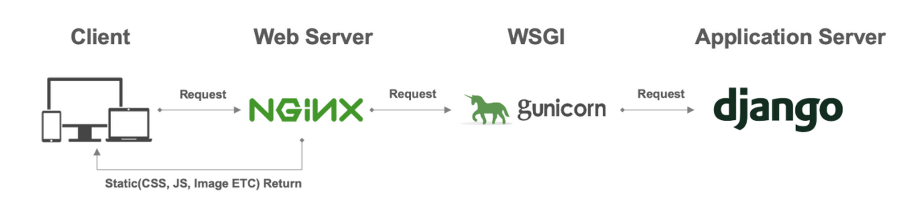

> `gunicorn`과 `python runserver`는 같은 역할을 하지만\
> `runserver`는 단일 쓰레드로 동작하기 때문에 request 요청이 많아질 경우 처리능력이 떨어진다.\
> 따라서 production 환경에서는 runserver 사용하지 못함

# 3주차 - Django 모델링
## Django와 MySQL 연동하기
Django에서 MySQL을 사용하기 위해서는 커넥터가 필요하다.
> 일반적으로 mysqlclient이나 pymysql을 사용\
> c로 작성된 mysqlclient가 속도 면에서 우수하다고 한다.

> $ pip install mysqlclient

가상환경 내 커넥터 패키지를 설치해주었다.\
이후 mysql에 내가 사용할 데이터베이스를 생성하고 확인한다.
> $ mysql -u root -p\
> mysql> create database <DB명>;\
> mysql> use <DB명>;\
> mysql> show tables;\
>> 테이블이 빈 것을 확인하면 정상!

이후 setting.py에서 데이터베이스 설정을 수정
```python
DATABASES = {
    'default': {
        'ENGINE': 'django.db.backends.mysql',
        'NAME': env('DATABASE_NAME'),
        'USER': env('DATABASE_USER'),
        'PASSWORD': env('DATABASE_PASSWORD'),
        'HOST': env('DATABASE_HOST'),
        'PORT': env('DATABASE_PORT'),
    }
}
```

### 오류 - migrate 작동 에러
설정을 완료하고 난 후 `python manage.py migrate` 명령을 통해 MySQL에 장고 기본 테이블을 생성하려 시도했으나 작동하지 않았다.
> NameError: name '_mysql' is not defined after setting change to mysql

정확한 원인은 모르겠지만 M1 맥을 사용하는 사람들에게 나와 같은 현상이 많은 것 같다.\
python이 _mysql이라는 패키지를 인식하지 못하는 듯...
수차례의 구글링과 몇번의 삽질 끝에 문제를 해결하였다.
> $ pip install pymysql

pymysql 이라는 패키지를 설치해주고 settings.py에 아래 두 줄을 추가해준다.
```python
import pymysql
pymysql.install_as_MySQLdb()
```

근본적인 해결책이 아닐 수도 있고 mysqlclient가 아직 M1 맥에 대해 호환이 잘 안되는 걸 수도 있지만 일단 동작한다는 점에 감사하게 생각한다.\
다시 한번 `python manage.py migrate` 명령을 실행해 확인한다.\
정상적으로 작동하였고, `mysql> show tables;` 명령 실행시 아래와 같이 장고의 기본 테이블이 출력된다
```text
+----------------------------+
| Tables_in_jstagram         |
+----------------------------+
| auth_group                 |
| auth_group_permissions     |
| auth_permission            |
| auth_user                  |
| auth_user_groups           |
| auth_user_user_permissions |
| django_admin_log           |
| django_content_type        |
| django_migrations          |
| django_session             |
+----------------------------+
10 rows in set (0.01 sec)
```
## 인스타그램 ERD

### 인스타그램 서비스 분석

> 사용자가 게시물(이미지, 영상 포함)을 올리고 다른 사용자들의 게시물에 좋아요, 댓글을 남기는 구조

[erdcloud](https://www.erdcloud.com/) 이용하여 ERD(Entity-Relationship Diagram 작성

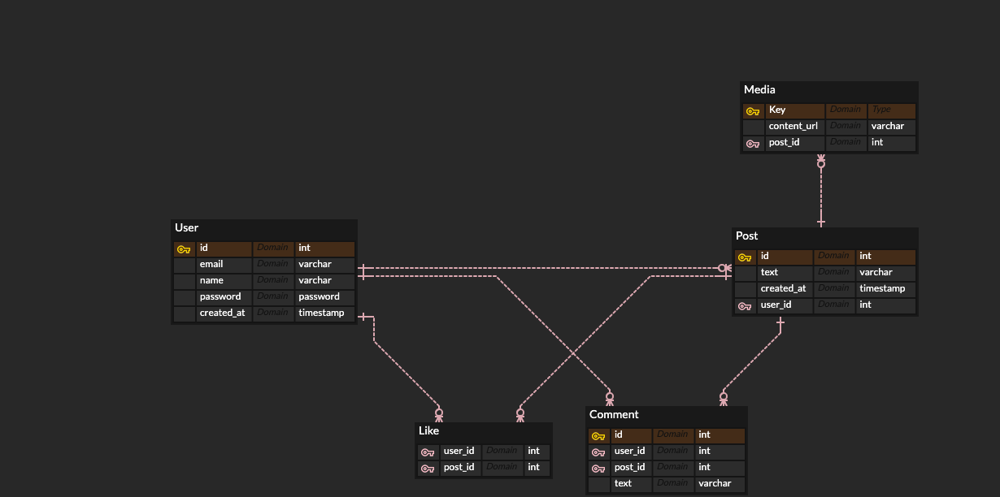
- 모델 정의
  - 
  - User: 사용자 
    - email
    - name
    - password
    - created_at
    
  - Post: 게시물(피드)
    - text
    - created_at
    
  - Media: 게시물에 들어가는 사진, 동영상
    - content_url
    
  - Like: 게시물에 누른 좋아요
  - Comment: 게시물에 단 댓글
    - text
- 관계 정의
  - 
  - User : Post = 1 : N
  > 하나의 User가 여러개의 Post 생성 가능\
  > 하나의 Post는 하나의 User 정보를 가짐
  - Post : Media = 1 : N
  > 하나의 Post에 여러개의 Media 삽입 가능\
  > 하나의 Media는 하나의 Post 정보를 가짐
  - User : Like = 1 : N
  - Post : Like = 1 : N
  > 한명의 User는 여러 Post에 Like 가능\
  > 하나의 Post에 여러 User로부터의 Like 존재
  - User : Comment = 1 : N
  - Post : Comment = 1 : N
  > 한명의 User는 여러 Post에 Comment 가능\
  > 하나의 Post에 여러 User로부터의 Comment 존재
  
## Django 모델 생성
앞서 작성한 ERD를 바탕으로 장고 모델을 정의한다
### 내가 원하는 User 모델 만들기
만약 장고에서 기본으로 제공해주는 유저 모델의 특성 외에 추가할 것이 있다면 네가지 방법이 존재한다.
- Proxy 방법

필드는 추가하지 않고 메서드만 만들어 사용하고 싶을 때
- OneToOne 방법
```python
from django.contrib.auth.models import User # Django 기본 User 모델

class Profile(models.Model):
    # User 객체와 1대1로 관계를 맺는 Profile 모델 생성
    user = models.OneToOneField(User, on_delete=models.CASCADE)
    # 내가 추가하고 싶은 필드
    new_field = models.CharField(max_length=500, blank=True)
```
모델을 정의해주고
```python
from django.db.models.signals import post_save
from django.dispatch import receiver

@receiver(post_save, sender=User)
def create_user_profile(sender, instance, created, **kwargs):
    if created:
        Profile.objects.create(user=instance)

@receiver(post_save, sender=User)
def save_user_profile(sender, instance, **kwargs):
    instance.profile.save()
```
`create_user_profile`와 `save_user_profile` 메서드를 User.save() 이벤트와 묶어준다.\
이를 통해 User 객체를 생성하고 갱신할 때 연결된 Profile 객체에도 반영된다.
> ### Django DB Query 최적화하기
>> 위의 Profile 같이 다른 모델과 관계가 지정된 모델의 경우\
> Queryset 사용에 주의할 필요가 있다고 한다\
> `profiles = Profile.objects.all()`\
> `profiles = Profile.objects.all().select_related('user')`\
> \
> 두 쿼리문은 같은 역할을 하지만 만약
> ```html
> 
> <div> {{profile.user.username}} </div>
> 
> ```
> 이와 같이 관계된 모델에 대한 field 값을 참조할 경우\
> `profiles = Profile.objects.all()` 는 profile 객체만큼의 쿼리문을 추가로 실행한다.\
> 만약 100개의 profile이 존재한다면, 총 1+100 = 101개의 쿼리문\
> 반면, `select_related` 사용 시 첫 쿼리문에서 관계된 모델의 필드값까지  가져오기 때문에 추가로 실행되는 쿼리문이 없다.

- AbstractBaseUser 방법

앞선 방법으로 부족하거나, django의 유저 인증 관련한 부분을 바꾸고 싶다면 django의 기본 유저모델 자체를 커스텀하는 방법이 있다.\
모델을 0부터 만드는 개념이라 좀 어려운게 단점..

- AbstractUser 방법

> Django User 모델이 기본적으로 제공하는 11개 field
> - id, username, first_name, last_name, email, password
> - last_login, is_superuser, is_staff, is_active, date_joined
```python
from django.contrib.auth.models import AbstractUser
class User(AbstractUser):
    # 추가로 사용할 필드 설정
    nickname = models.CharField(max_length=30, blank=True)
```
```python
# settings.py
AUTH_USER_MODEL = 'api.User'
```
> OneToOne 방법과 다른점은 추가로 Class(Table) 생성하지 않는다는 점

### 하나의 모델에서 둘 이상의 Foreignkey 사용 시

```python
class Like(models.Model):
    user = models.ForeignKey('User', on_delete=models.CASCADE, related_name='user_likes')
    post = models.ForeignKey('Post', on_delete=models.CASCADE, related_name='post_likes')
```
두 개 이상의 ForeignKey 사용할 경우, 각각에 적절한 related_name을 부여해서 충돌이 없도록 한다.

### ImageField, FileField 사용
Post에 삽입되는 Image 또는 Video를 위해 ImageField, FileField를 사용할 경우 `pillow` 패키지가 필요하다
> $ pip install pillow


### DB 확인
User 모델을 커스텀하기 전 migrate를 통해 DB에 Django 기본 테이블을 생성해놨기 때문에
DB를 삭제한 후 다시 생성해서 migrate 명령을 수행했다.
```
mysql> show tables;
+---------------------------+
| Tables_in_jstagram        |
+---------------------------+
| api_comment               |
| api_image                 |
| api_like                  |
| api_post                  |
| api_user                  |
| api_user_groups           |
| api_user_user_permissions |
| api_video                 |
| auth_group                |
| auth_group_permissions    |
| auth_permission           |
| django_admin_log          |
| django_content_type       |
| django_migrations         |
| django_session            |
+---------------------------+
15 rows in set (0.00 sec)
```
api 앱에 생성한 모델이 DB Table로 생성된 것을 확인할 수 있다.

## ORM 적용해보기
User 객체 3개를 생성하였다.
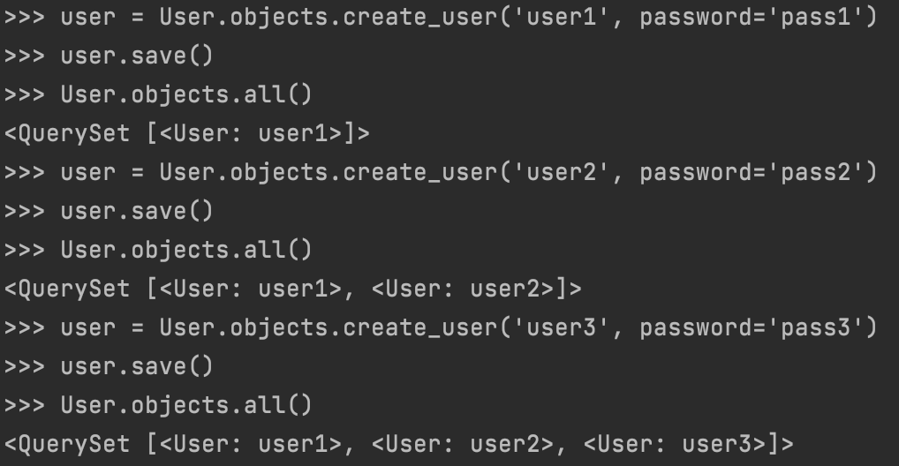

User 객체를 ForeignKey로 갖는 Post 객체를 생성할 때는 생성자의 인자로 User 객체를 넘겨줘야 한다
```
user1 = User.objects.get(id=1)
user2 = User.objects.get(id=2)
user3 = User.objects.get(id=3)
```

세개의 User 객체를 변수에 담아준 뒤
```
post1 = Post(text="post1", user=user3)
post2 = Post(text="post2", user=user2)
post3 = Post(text="post3", user=user3)
post1.save(); post2.save(); post3.save();
```

ForeignKey 설정에 맞게 Post 객체를 생성해 준다.
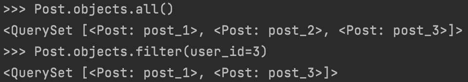

총 3개의 Post가 생성되었고, user3이 작성한 Post는 두개인 것을 확인할 수 있다.

### Like 객체 생성해보기

```
like1 = Like(user=user1, post = post3)
like2 = Like(user=user1, post = post2)
like3 = Like(user=user2, post = post2)
```

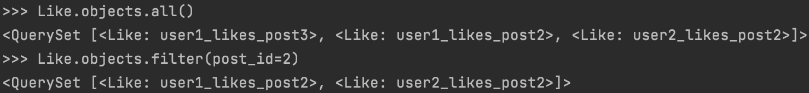
내가 정의한 __str__ 메서드에 맞게 Like 객체가 출력되는 것을 확인하였다.

## 3주차 과제 회고

모델을 머리속으로만 생각하고 설계하는 것은 쉽지만\
ERD 를 직접 작성하면서 설계하는 것은 생각보다 고려할 부분이 많다.\
특히 모델간의 관계(1:1, 1:N, N:M)을 설정함에 있어서 이게 맞는 관계인가에 대해 계속 고민하게 되는 듯 하다.

다행인건 Django ORM이 굉장히 유저친화적으로 되어 있어서 복잡한 SQL문법을 쓰지 않아도 된다는 점..

데이터 다루는 건 언제나 어렵고 그나마 인스타그램이라는 서비스를 가지고 공부하니까 좀 나은것 같다

## 3주차 과제 피드백

가능하면 모든 모델에 created_at, updated_at 필드를 부여하는 것이 추후 데이터 관리에 도움이 된다고 한다. 좋은 습관을 들이기 위해 나도 기존의 모델을 조금 수정하기로 했다.
```python
# models.py
class BaseModel(models.Model):
    created_at = models.DateTimeField(auto_now_add=True)
    updated_at = models.DateTimeField(auto_now=True)

    class Meta:
        abstract = True
```
위와 같이 Timestamp 데이터를 담는 `Abstract Model`을 선언해주고 다른 모델에서 이를 상속하여 사용한다.

- `Abstract Model`은 여러 Model에 공통으로 사용되는 필드가 있을 때, 코드의 중복을 최소화하기 위해 사용
- `Abstract Model`은 가상의 모델이기 때문에, DB에서 테이블이 생성되지 않음

```python
class Post(BaseModel):
    text = models.TextField(blank=True)
    user = models.ForeignKey(
        'User', on_delete=models.CASCADE, related_name='posts')

    def __str__(self):
        return 'post_' + str(self.id)
```
- 기존 `Post` 에서 create_at 필드를 직접 설정해줬던 것과 달리, BaseModel을 상속받는 것을 통해 created_at, updated_at 필드가 자동으로 추가된다.


# 4주차 DRF - Serializer
## django admin 이용해서 모델 관리하기
지난 과제 때는 생성한 모델에 데이터를 추가하고 관리하는 과정을 ORM 쿼리를 사용했다. 장고에서는 이 외에도 Django admin 페이지를 통해 `GUI` 로 모델을 관리하는 방법을 제공한다.
```python
# admin.py
from django.contrib import admin
from .models import *

admin.site.register(User)
admin.site.register(Post)
admin.site.register(Image)
admin.site.register(Video)
admin.site.register(Like)
admin.site.register(Comment)
```
이처럼 admin.py에 내가 생성한 모델을 등록하면 서버를 실행한 후 localhost:8000/admin 주소에서 모델을 관리할 수 있다.
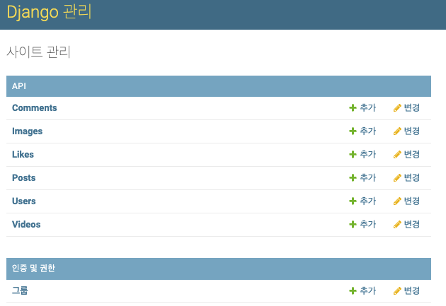

각각의 모델 목록도 확인할 수 있다. 이때 나오는 이름은 내가 모델에 부여했던 `__str__` 반환값과 같다.

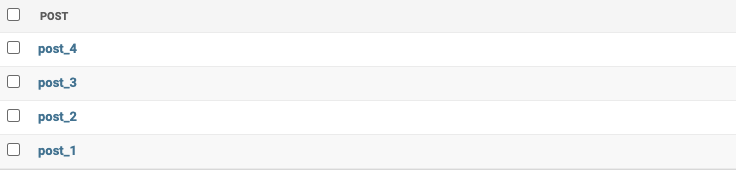

그런데 각 객체의 필드값을 확인하려면 하나씩 클릭해서 들어가야 하고, 이 과정이 불편하게 느껴졌다. 역시나 유저친화적인 장고는 이 부분에 대한 해결책을 제공해준다.. 장고짱
```python
# admin.py
@admin.register(Post)
class PostAdmin(admin.ModelAdmin):
    list_display = ['id', 'get_text',
                    'get_likes_count',
                    'get_comments_count',
                    'created_at', 'updated_at']
    list_display_links = ['id', 'get_text']

    def get_text(self, post):
        return f'{post.text[:20]} ...'
    get_text.short_description = '내용'

    def get_likes_count(self, post):
        return f'{post.post_likes.count()}개'
    get_likes_count.short_description = '좋아요'

    def get_comments_count(self, post):
        return f'{post.post_comments.count()}개'
    get_comments_count.short_description = '댓글'
```
- 앞서 `admin.site.register(Post)`로 간단히 등록해주었던 코드를 내 입맛에 맞게 바꿔주었다.
- `list_display` 에는 리스트에서 보고싶은 필드 또는 멤버 함수 지정 가능
- 멤버 함수를 만들어서 내가 원하는 정보를 한눈에 보기 쉽도록 만들었다
  > 게시글 내용을 앞의 20글자만 보여주고, 좋아요 수, 댓글 수를 요약해서 보여줄 수 있도록!!

- 커스텀 이후 django admin 화면
  
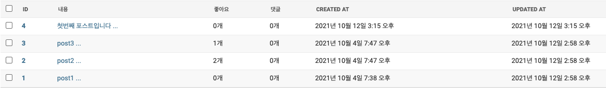
> 한결 보기 편해졌다..

## Serializer 작성하기
- 클라이언트의 요청에 Json 형태로 응답하기 위해 Serializer를 사용
- ModelSerializer 사용하면 나의 모델에 맞게 장고가 기본적인 Serializer를 작성해주고, 필요에 의해 커스텀해서 사용 가능

```python
class MySerializer(serializers.ModelSerializer):
    class Meta:
        model = MyModel # 사용 모델
        fields = ['id', 'field1', 'field2', 'field3'] # 선택된 필드만
        fields = '__all__' # 모든 필드 사용
```

과제에서 가장 공을 들인 부분이 PostSerializer 이다. 인스타그램의 핵심 기능이라고도 볼수 있기 때문에 게시글에 관련된 데이터를 어떻게 정리해서 Json 형식으로 넘겨줄까에 대해 고민을 많이 했다.
```python
class PostSerializer(serializers.ModelSerializer):
    author = serializers.SerializerMethodField()
    like_username_list = serializers.SerializerMethodField()
    post_comments = CommentSerializer(many=True, read_only=True)

    class Meta:
        model = Post
        fields = ['id', 'text', 'author', 'like_username_list', 'post_comments', 'created_at', 'updated_at', ]

    def get_author(self, obj):  # 작성자 username 반환
        return obj.user.username

    def get_like_username_list(self, obj):  # 게시글에 좋아요 누른 사용자의 username만을 받아와서 리스트로 저장
        return [like.user.username for like in obj.post_likes.all()]
```
- 원래 Post에는 user_id가 저장되어 있는데, 나는 username을 보내고 싶어서 author라는 필드를 추가했다. `SerializerMethodField` 를 사용하였다.
- `like_username_list` 또한 내가 추가한 정보인데, 게시글에 좋아요 누른 사용자의 username을 받아와서 리스트로 저장하였다. 인스타그램에서 좋아요한 사람 목록이 뜨는 느낌으로 생각했다.
- `post_comments` 는 NestedSerializer 방법을 이용했는데, 이는 댓글에 대한 모든 정보(작성자, 시간, 등등..)가 필요하기 때문이다. CommentSerializer를 이용해서 Comment에 대한 데이터 값을 직렬화하고 이를 PostSerializer 내에 합치는 구조라고 보면 될 것 같다.

## 과제 수행 결과
### 모델 선택 및 데이터 삽입 - Post 모델
```python
class Post(BaseModel):
    text = models.TextField(blank=True)
    user = models.ForeignKey(
        'User', on_delete=models.CASCADE, related_name='posts')

    def __str__(self):
        return 'post_' + str(self.id)

class Like(BaseModel):
    user = models.ForeignKey(
        'User', on_delete=models.CASCADE, related_name='user_likes')
    post = models.ForeignKey(
        'Post', on_delete=models.CASCADE, related_name='post_likes')

    def __str__(self):
        return self.user.username + '_likes_post' + str(self.post_id)

class Comment(BaseModel):
    text = models.CharField(max_length=100, blank=False)
    user = models.ForeignKey(
        'User', on_delete=models.CASCADE, related_name='user_comments')
    post = models.ForeignKey(
        'Post', on_delete=models.CASCADE, related_name='post_comments')

    def __str__(self):
        return self.user.username + '_comments_post' + str(self.post_id)
```
> Post와 Like, Comment 객체를 생성한 후 admin 사이트에 들어가 커스텀한 대로 잘 나오는 것을 확인하였다.

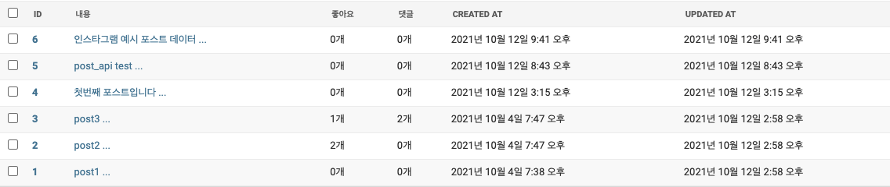

### 모든 Post 객체를 가져오는 API 만들기
- URL: api/posts
- Method: GET

```json
[
    {
        "id": 1,
        "text": "post1",
        "author": "user3",
        "like_username_list": [],
        "post_comments": [],
        "created_at": "2021-10-04T19:38:56.832719+09:00",
        "updated_at": "2021-10-12T14:58:58.218076+09:00"
    },
    {
        "id": 2,
        "text": "post2",
        "author": "user2",
        "like_username_list": [
            "user1",
            "user2"
        ],
        "post_comments": [],
        "created_at": "2021-10-04T19:47:06.953963+09:00",
        "updated_at": "2021-10-12T14:58:58.218076+09:00"
    },
    {
        "id": 3,
        "text": "post3",
        "author": "user3",
        "like_username_list": [
            "user1"
        ],
        "post_comments": [
            {
                "id": 1,
                "created_at": "2021-10-12T18:12:50.703905+09:00",
                "updated_at": "2021-10-12T18:12:50.704003+09:00",
                "text": "우린 깐부자나",
                "user": 1,
                "post": 3
            },
            {
                "id": 2,
                "created_at": "2021-10-12T18:13:10.307574+09:00",
                "updated_at": "2021-10-12T18:13:10.307699+09:00",
                "text": "그만해 이러다 다죽어",
                "user": 3,
                "post": 3
            }
        ],
        "created_at": "2021-10-04T19:47:43.490490+09:00",
        "updated_at": "2021-10-12T14:58:58.218076+09:00"
    },
    {
        "id": 4,
        "text": "첫번째 포스트입니다",
        "author": "user1",
        "like_username_list": [],
        "post_comments": [],
        "created_at": "2021-10-12T15:15:36.616461+09:00",
        "updated_at": "2021-10-12T15:15:36.616534+09:00"
    },
    {
        "id": 5,
        "text": "post_api test",
        "author": "user1",
        "like_username_list": [],
        "post_comments": [],
        "created_at": "2021-10-12T20:43:16.684445+09:00",
        "updated_at": "2021-10-12T20:43:16.684728+09:00"
    },
    {
        "id": 6,
        "text": "인스타그램 예시 포스트 데이터",
        "author": "mongus",
        "like_username_list": [],
        "post_comments": [],
        "created_at": "2021-10-12T21:41:59.792145+09:00",
        "updated_at": "2021-10-12T21:41:59.792247+09:00"
    }
]
```

### 새로운 데이터를 create 요청하는 API
- URL: api/posts
- Method: POST
- Body: {"text": "blahblah"}

```json
{
    "id": 7,
    "text": "blahblah",
    "author": "user1",
    "like_username_list": [],
    "post_comments": [],
    "created_at": "2021-10-12T21:54:48.448050+09:00",
    "updated_at": "2021-10-12T21:54:48.448767+09:00"
}
```

## N+1 문제 관련
PR을 올리고 준환님께서 감사하게도 Serializer 내의 코드에서 N+1 문제가 발생할 수도 있다고 지적해주셨다. 다시 검토해보니까 문제가 있는 것 같아서 직접 테스트해보기로 했다.

문제가 되는 부분은 PostSerializer에서 게시글에 좋아요한 사람의 목록을 받아오는 코드였다.
현재 모델은 아래와 같이 연결되어 있다.
```
Post          Like          User
              user          user_likes
post_likes    post
```

> PostSerializer 에서 post_likes로 Like 객체들을 참조하고, 각 Like 객체에 연결된 User를 참조

- 원래 코드
```python
class PostSerializer(serializers.ModelSerializer):

    def get_like_username_list(self, obj): # 여기서 obj는 Post 객체
        return [like.user.username for like in obj.post_likes.all().select_related('user')]
```
- 쿼리문 수 테스트

좋아요한 유저가 2명 있는 post2 객체를 대상으로 테스트했다.\
```
>>> from django.db import connection, reset_queries
>>> username_list = [like.user.username for like in post2.post_likes.all()]
>>> len(connection.queries)
3

>>> reset_queries()
>>> username_list = [like.user.username for like in post2.post_likes.all().select_related('user')]
>>> len(connection.queries)
1
```
> 기존에 2+1개의 query를 발생시키던 코드가 `select_related` 사용 시에는 1개의 query만으로 해결되는 것을 확인하였다.
>> N개의 객체가 연결되어 있을 때는 N+1개의 query를 발생시키게 되고, 성능 저하에 영향을 줄 수 있다
## 4주차 과제 회고
Serializer를 다루면서 프론트와의 협업에 한걸음 다가간 듯 하다. 내가 원하는 형식으로, 내가 원하는 데이터를 담아서 보낼 수 있다는 점에서 Serializer의 편의성에 놀랐다. 한편 설계를 잘못 하면 데이터 쿼리문을 너무 많이 호출하게 되고, 응답시간이 길어질 수도 있다고 한다. 이 부분에 심도 있는 공부가 필요할 것 같다.


# 5주차 DRF2 - API View
## 모든 list를 가져오는 API
- URL: api/post
- Method: GET
```json
[
    {
        "id": 1,
        "text": "post1",
        "author": "user3",
        "like_username_list": [],
        "post_comments": [],
        "created_at": "2021-10-04T19:38:56.832719+09:00",
        "updated_at": "2021-10-12T14:58:58.218076+09:00"
    },
    {
        "id": 2,
        "text": "post2",
        "author": "user2",
        "like_username_list": [
            "user1",
            "user2"
        ],
        "post_comments": [],
        "created_at": "2021-10-04T19:47:06.953963+09:00",
        "updated_at": "2021-10-12T14:58:58.218076+09:00"
    },
    {
        "id": 3,
        "text": "post3",
        "author": "user3",
        "like_username_list": [
            "user1"
        ],
        "post_comments": [
            {
                "id": 1,
                "created_at": "2021-10-12T18:12:50.703905+09:00",
                "updated_at": "2021-10-12T18:12:50.704003+09:00",
                "text": "우린 깐부자나",
                "user": 1,
                "post": 3
            },
            {
                "id": 2,
                "created_at": "2021-10-12T18:13:10.307574+09:00",
                "updated_at": "2021-10-12T18:13:10.307699+09:00",
                "text": "그만해 이러다 다죽어",
                "user": 3,
                "post": 3
            }
        ],
        "created_at": "2021-10-04T19:47:43.490490+09:00",
        "updated_at": "2021-10-12T14:58:58.218076+09:00"
    },
    {
        "id": 4,
        "text": "첫번째 포스트입니다",
        "author": "user1",
        "like_username_list": [],
        "post_comments": [],
        "created_at": "2021-10-12T15:15:36.616461+09:00",
        "updated_at": "2021-10-12T15:15:36.616534+09:00"
    },
    {
        "id": 5,
        "text": "post_api test",
        "author": "user1",
        "like_username_list": [],
        "post_comments": [],
        "created_at": "2021-10-12T20:43:16.684445+09:00",
        "updated_at": "2021-10-12T20:43:16.684728+09:00"
    },
    {
        "id": 6,
        "text": "인스타그램 예시 포스트 데이터",
        "author": "mongus",
        "like_username_list": [],
        "post_comments": [],
        "created_at": "2021-10-12T21:41:59.792145+09:00",
        "updated_at": "2021-10-12T21:41:59.792247+09:00"
    },
    {
        "id": 7,
        "text": "blahblah",
        "author": "user1",
        "like_username_list": [],
        "post_comments": [],
        "created_at": "2021-10-12T21:54:48.448050+09:00",
        "updated_at": "2021-10-12T21:54:48.448767+09:00"
    },
    {
        "id": 8,
        "text": "test post 345",
        "author": "user1",
        "like_username_list": [],
        "post_comments": [],
        "created_at": "2021-11-11T02:50:57.140388+09:00",
        "updated_at": "2021-11-11T02:50:57.141211+09:00"
    }
]
```

## 특정 데이터를 가져오는 API
- URL: api/post/3
- Method: GET
```json
{
    "id": 3,
    "text": "post3",
    "author": "user3",
    "like_username_list": [
        "user1"
    ],
    "post_comments": [
        {
            "id": 1,
            "created_at": "2021-10-12T18:12:50.703905+09:00",
            "updated_at": "2021-10-12T18:12:50.704003+09:00",
            "text": "우린 깐부자나",
            "user": 1,
            "post": 3
        },
        {
            "id": 2,
            "created_at": "2021-10-12T18:13:10.307574+09:00",
            "updated_at": "2021-10-12T18:13:10.307699+09:00",
            "text": "그만해 이러다 다죽어",
            "user": 3,
            "post": 3
        }
    ],
    "created_at": "2021-10-04T19:47:43.490490+09:00",
    "updated_at": "2021-10-12T14:58:58.218076+09:00"
}
  ```

## 새로운 데이터를 생성하는 API
- URL: api/post
- Method: POST
- Body: {"text": "test post no.33"}
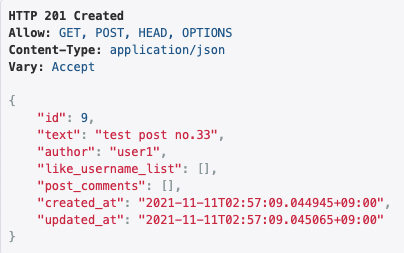


## 특정 데이터를 업데이트하는 API
- URL: api/post/9
- Method: PUT
- Body: {"text": "update post no.33"}
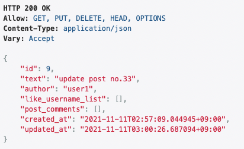

## 특정 데이터를 삭제하는 API
- URL: api/post/9
- Method: DELETE
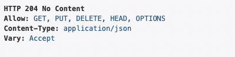

## 공부한 내용 정리
### API View (CBV)
- Django의 View 클래스의 하위 클래스
- CBV 중 하나. 이에 대응되는 FBV로는 `@api_view` decorator 사용
- 하나의 class -> 하나의 url에 대한 여러 Method 처리
  - `PostList`: /post 에 대한 class 
    - GET: 전체 게시글 목록 조회
    - POST: 새로운 게시글 추가
  - `PostDetail`: /post/<int:pk> 에 대한 class 
    - GET: (pk=pk)인 게시글 조회
    - PUT: (pk=pk)인 게시글 수정
    - DELETE: (pk=pk)인 게시글 삭제

- `as_view()`
```python
# urls.py
urlpatterns = [
    path('post', PostList.as_view()),
    path('post/<int:pk>', PostDetail.as_view()),
]
```
`as_view()` 호출로 CBV 인스턴스를 생성.\
인스턴스는 내부에서 `dispatch()` 메서드를 통해 Request Method를 확인하여 CBV에 정의한 Method에 연결한다.
> 만약 PUT 메서드 요청이 들어왔는데, 클래스에 PUT 메서드가 정의되지 않았다면 `HttpResponseNotAllowed` 에러 발생시킴.

## 간단한 회고
Django Rest Framework에 대해
- Serializer
- View (FBV)
- API View (CBV)

순서로 배우고 있는데, 아직 확실하게 감이 잡히진 않는다.\
이것만 가지고 API 서버를 개발할 수 있을까 하는 의문이 생긴다..\
추후 스터디에서 ViewSet이나 Authentication, Permission 등을 배우고 나면 감이 잡히지 않을까 싶다. 적어도 내가 만들고 싶은 사이트 정도는 개발할 수 있을 정도..?

# 참고자료
- [Django Tips #3 Optimize Database Queries](https://simpleisbetterthancomplex.com/tips/2016/05/16/django-tip-3-optimize-database-queries.html)
- [REST API 제대로 알고 사용하기](https://meetup.toast.com/posts/92)
- [admin 커스터마이징](https://wayhome25.github.io/django/2017/03/22/django-ep8-django-admin/)
- [Classy Django REST Framework](https://www.cdrf.co)